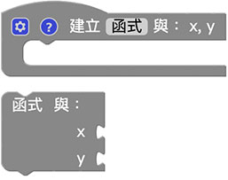

# Web:Bit 函式

函式积木可以帮助我们简化或管理较为复杂的程式逻辑，因为在写程式的时候，常会遇到需要重复撰写并执行的程式码，如果每重复一次都得重写一次，势必会造成整份程式逻辑的复杂度，透过函式，将这些重复的程式集中管理，需要使用的时候再去呼叫函式，就可以执行对应的内容。

## 函式积木清单

函式积木预设有三块，分别是建立函式、建立带有回传值的函式、函式内判断并回传值。

## 建立函式{{function01}}

「建立函式」积木可以将许多重复会用到的程式积木包装成函式。

使用建立函式积木*并不会执行函式*，因为函式是*定义「需要执行的内容」*，建立完成函式积木内容后，在函式积木的目录里，就会出现对应的*执行函式积木*，使用这块积木才表示执行这个函式。

下图建立了 a 和 b 两个函式之后，使用*呼叫函式 a 和 b*，执行后，绿色小怪兽就会说出苹果，红色小怪兽就会说出香蕉。 ( *如果单纯只有建立函式而不呼叫，执行后什么事情都不会发生* )

除了单纯的使用函式，我们也可以建立「*函式内的变数*」，点选函式积木前方的小齿轮，就可以新增变数。

新增函式内的变数后，执行函式时也会看到放入变数数值的缺口。 ( 有几个函式内的变数就会有几个缺口 )

函式内的变数让程式增加了许多弹性，并也可以减少许多重的程式码，举例来说，透过函式和函式内变数，就能做出提供变数数值，就算出数值加总的函式。

## 建立带有回传值的函式{{function02}}

「建立带有回传值的函式」积木可以让执行的函式，变成单纯的数值，这对于一些复杂的程式应用相当有帮助。

如果使用的是「建立带有回传值的函式」，就会发现执行函式时积木前方多了一个作为组合用的形状。 ( 下图是延伸前一段建立带有函式内变数的函式 )

透过函式内的变数，搭配函式回传的数值，就能做到依据提供的变数数值不同 ( x、y 不同值 )，而产生不同的结果。

## 函式内判断并回传值{{function03}}

「函式内判断并回传值」积木必须和「建立带有回传值的函式」的积木搭配，主要作为判断要回传什么数值使用。 ( 这个积木也必须放在函式内才能正常运作 )

透过这个积木，搭配函式内的变数，就可以透过传入的变数数值，最后回传 x 和 y 哪个比较大的结果。

因为「函式内判断并回传值」积木具备逻辑判断的功能，所以也可以使用逻辑积木加上一个变数来做判断，就能做出一模一样的效果。

