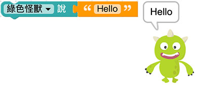
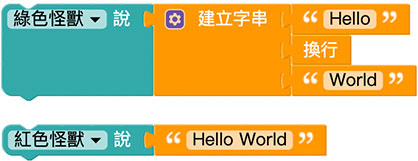
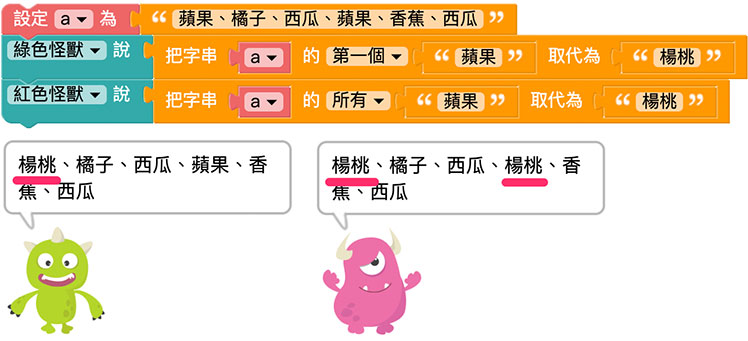
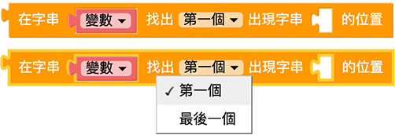
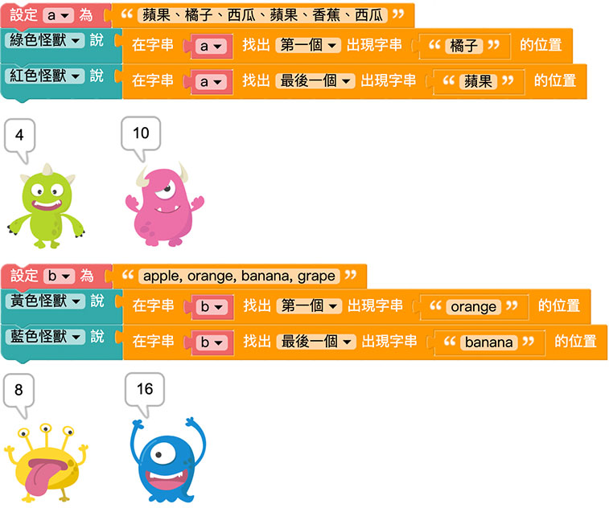
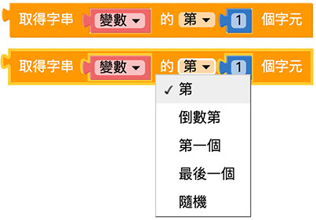
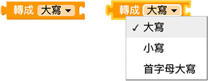
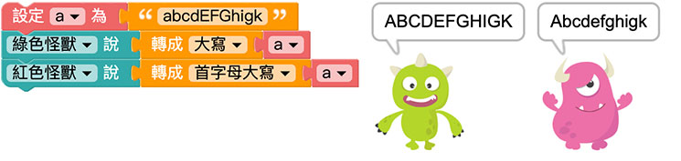
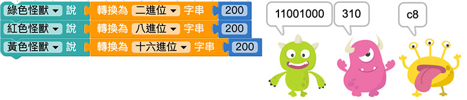
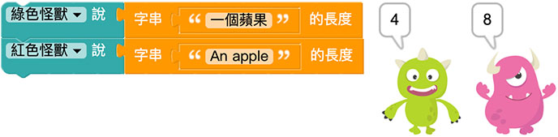

# Web:Bit 文字

文字积木除了可以显示有意义的词汇，也可以透过相加的方式把文字组合，或是在一段词汇中寻找对应的字词或字母，甚至也可显示语音辨识的内容或物联网串感器的状态。

## 文字积木清单

文字积木分别有指定文字、换行、转换大小写、建立字串、文字工具、文字查找、文字取代、文字转换...等常用的文字功能。

## 指定文字{{text01}}

「指定文字」积木可以输入指定的文字，以便其他积木使用。

例如在小怪兽讲话积木后方接上指定文字，输入 hello，执行后小怪兽就会说出 hello。

## 换行{{text02}}

「换行」积木可以将一段文字从指定的位置折行。

## 建立字串{{text12}}

「建立字串」积木可以把不同的文字积木组合成一段文字。

点击蓝色小齿轮，透过拖拉组合可以增加文字缺口。

在文字缺口内放入指定的文字积木或是换行积木，就可以认字组合出欲显示的文字，从下图可以看到组合过的文字和单行文字的差异。

建立字串也可以用来组合两个变数，例如变数 a 为 hello，变数 b 为 world，透过建立字串就能将两个变数组合为中间换行的 hello world。

## 在变数后方加入文字{{text03}}

「在变数后加入文字」能够改变原本变数的内容，使原本变数的内容后方额外增加文字。

因为是以「变数」为主，所以如果要让小怪兽讲话，就变成是使用变数的方式呈现。

## 取代文字{{text04}}

「取代文字」积木可以快速将一段文字里的某些字，替换为其他的文字，下拉选单可以选择要更换第一个指定的文字，或所有指定的文字。 ( 取代文字不会对变数进行变更，而是产生一段全新的文字 )

下图的例子可以只更换第一个「苹果」变成「杨桃」，或是更换所有的「苹果」为「杨桃」。

## 寻找字串出现位置{{text05}}

「寻找字串出现位置」会回传指定文字在一段文字中出现的位置，可以选择第一个出现的位置或最后一个出现的位置。

文字出现的位置是以「字数」来判断，以下图的例子，橘子的「橘」位在整段文字的第4 个位置，所以出现的数字为4，苹果的苹出现在第10 个位置，如果换成英文，orange 的o 位在第10 个位置，banana 的b 位在第16 个位置。

## 取得指定位置的文字{{text06}}

「取得指定位置的文字」积木会取出指定位置的文字，下拉选单共有五种指定位置，分别是第几个、倒数第几个、第一个、最后一个和随机位置。

以下图的例子，第 4 个字是橘，第 11 个字是果。

## 取得指定区间的文字{{text07}}

「取得指定区间的文字」积木会取出一段指定区间内的文字，需注意的是*第一个空格的数字要比第二个空格内的数字小*。

以下图的例子，第 3~8 的文字为「、橘子、西瓜」，而第 8 到最后的文字为「瓜、苹果、香蕉、西瓜」。

## 转换大小写{{text08}}

「转换大小写」积木可以针对「英文字」进行大小写转换，包含全部转大写、全部转小写或是首字母大写。

以下图的例子，可以全部转换为大写，或是只有第一个 A 是大写。

## 消除空格{{text09}}

「消除空格」积木可以消除一段文字中左边、右边或左右两边的空白字元。

## 进位转换{{text10}}

「进位转换」积木能把数字转换为二进位、八进位、十进位或十六进位的文字。

例如数字 200 转换为二进位就是 11001000，转换为八进位就是 310，转换为十六进位就是 c8。

## 文字长度{{text11}}

「文字长度」积木可以取得一串文字的总字数，比较需要注意的是英文字以「字母」为单位，且空白也算是一个字元。

以下图为例，「一个苹果」的文字长度为 4，「An apple」因为包含空格，所以文字长度为 8。

