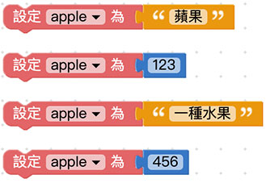
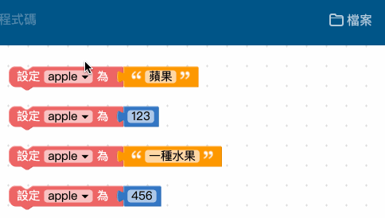
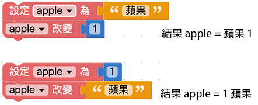
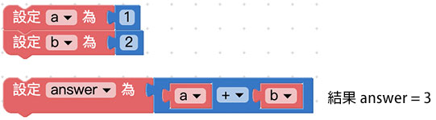

# Web:Bit 变数

变数，是所有程式都会用到的基本元素，使用前会赋予变数一个名称，接着就可以用这个变数来表示文字、数字、阵列、颜色或逻辑，为什么要使用变数呢？因为在编辑程式往往会遇到许多「重复」的部分，如果用变数或函式装载这些重复的部分，就能很简单的进行「一次性」新增、删除或修改动作。

举例来说，如果一段文章出现了五十次「A」，要把「A」修改为「B」，若不使用变数则得要手动修改五十次才办得到( 不考虑编辑软体的搜寻取代功能)，但如果今天我们用「变数a 等于A」，在修改的时候只需做一次动作：「把变数a 等于B」，就能把所有的「A」换成「B」，下方的教学内容将会深入介绍。

## 新增变数{{add}}

使用变数的第一步，就是「新增一个变数」，打开Web:Bit 编辑器，将「*设定变数为*」的积木拖拉到画面中，下拉选单选择「*新变数*」，点选后弹出对话视窗，输入新变数的名称及可新增一个变数。 ( 建议变数的命名尽可能以「英文 + 数字」为主 )

在新增的变数后方加上对应的值 ( 值可以是文字、数字、阵列、颜色或逻辑 )，这个变数就等同于这个值，如果没有赋予值，这个变数就是空变数。

新增变数后，在左侧积木清单的变数目录下，也会看到新增的变数积木。

> 注意，如果在编辑画面里完全没有「设定变数为 XXX」的积木，积木清单里就不会看见 XXX 的变数积木。

## 设定变数{{set}}

设定变数表示赋予变数一个值，使用方式和新增变数完全相同，由于程式语言有「*后面覆盖前面*」的特性，所以*如果变数名称相同，后面设定的值会覆盖掉前面设定的值* ，以下图的例子而言，变数apple 最后的值为456。

## 重新命名变数{{rename}}

有别于「新增变数」，重新命名变数可以将画面中所有的变数一次改名，例如画面里出现了四次 apple 的变数，透过重新命名，可以将四个 apple 变数名称全部换成 ball。

## 改变变数{{change}}

改变变数表示「*让变数的值改变多少*」，假设原本变数的值为1，使用改变变数1 之后，这个变数就会变成2，同理，如果使用改变变数-1，那么这个变数就会变成0。

注意，如果是不同类型的改变，例如原本的变数是文字「苹果」，却改变数字「1」，最后得到的结果是「苹果1」三个字，同理如果是变数是「1」，而改变文字「苹果」，得到的结果是「1苹果」。

## 使用变数{{use}}

新增变数或设定变数完成后，就可以在编辑区中使用变数，以下图为例，先设定a 变数为1，b 变数为2，接着就能计算a + b 或a 除以b 之类的数学运算，或透过逻辑判断a 和b 哪个值比较大，当程式逻辑越来越复杂，就得藉由不同的变数来实作。

