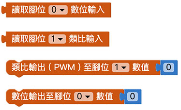
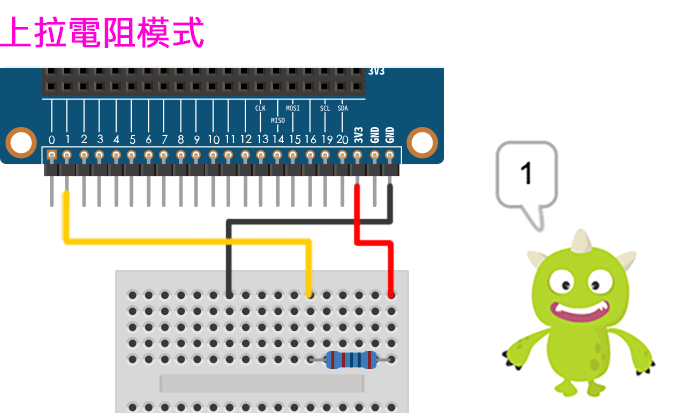
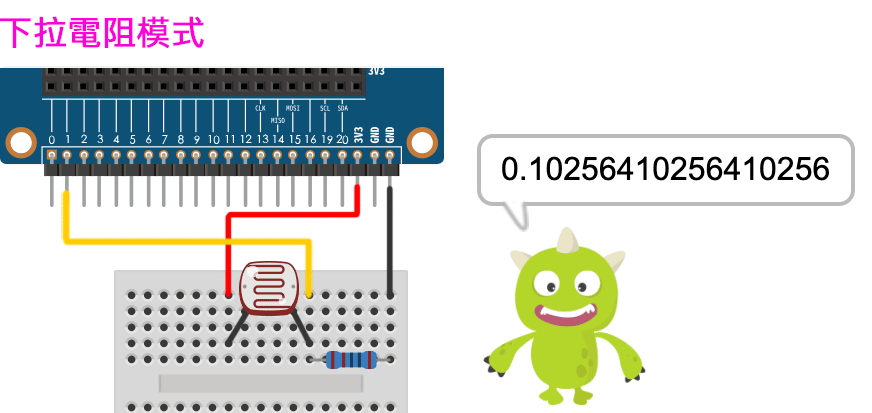
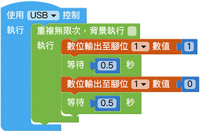

# Web:Bit I/O 引脚

在 Web:Bit 开发板边缘有一排有 25 个金属接触点，这些金属接触点称为「引脚」，或通俗一点也可称呼「金手指」。引脚包含了5 个标注0、1、2、3V 和GND 的大引脚，以及其他20 个未标示号码的小引脚，除了可以使用鳄鱼夹操作大引脚，也可以使用扩充板搭配杜邦线操作小引脚，透过引脚的搭配，就能灵活的操作各种外接元件与感测器。

> 如果要使用I/O 引脚功能，需搭配Web:Bit 扩充板，购买方式请参考：[Web:Bit 扩充板](https://store.webduino.io/products/webbit-extension-board? utm_source=webbit&utm_medium=article#_blank)

## I/O 引脚对照表

## I/O 引脚积木清单

I/O 引脚积木包含数位和类比输入、数位和类比 ( PWM ) 输出共四种积木。

> *I/O 引脚积木必须搭配「开发板」积木，且不支援模拟器*，只支援 USB 与 Wi-Fi 控制。
> - USB 控制模式为「安装版编辑器」限定，请参考 [Web:Bit 编辑器](../index.html#software)
> - Wi-Fi 模式需要开发板连接 Wi-Fi，请参考 [Web:Bit 硬体开发板 ( 初始化设定 )](../info/setup.html)

## 读取数值 ( 数位输入 ){{pin01}}

使用数位输入的积木，读取的数值只会有1 和0 两种讯号，预设在完全没有接传感器的状态下数值为1，程式积木透过一个无穷重复回圈的积木，不断读取脚位讯号。

可以使用「杜邦线+ 面包板+ 电阻」进行测试，并采取「*上拉电阻*」的方法，在程式执行后，将杜邦线连接讯号线和GND ( 或按下开关)，程式便会收到0 的讯号。

## 读取数值 ( 类比输入 ){{pin02}}

使用类比输入的积木，读取的数值为 0～1 之间的浮点数，程式积木透过一个无穷重复回圈的积木，不断读取脚位讯号。 ( 类比输入仅支援 1 号和 2 号引脚 )

可以使用「光敏电阻+ 杜邦线+ 面包板+ 电阻」进行测试，下方范例并采取「*下拉电阻*」的方法，在程式执行后，程式便会收到0～1 的类比讯号，光线越强数字越大，光线越弱数字越小。

## 输出数值{{pin03}}

输出的积木分成两种，一种是类比输出( PWM )，可以输出0～1 之间的浮点数，另外一种是数位输出，仅能输出0 和1 两种数值，以下方的例子而言，透过一个回圈的方式，透过*类比输出*积木，不断输出0～1 之间的浮点数作为LED 的亮度，就能做出呼吸灯的效果。 ( 直接将 LED 长脚接在扩充板的 1 号引脚，短脚接在 GND )

如果使用*数位输出*积木，虽然无法设计 LED 呼吸灯的效果，但仍然可以透过回圈，设计出灯光闪烁的范例。

