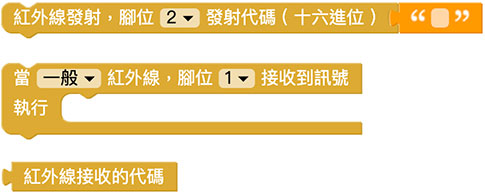
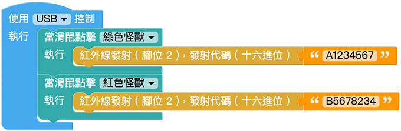
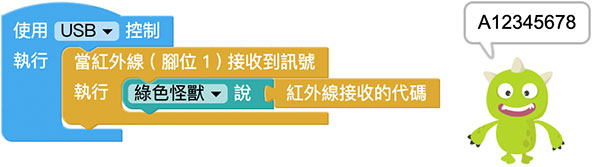

# 红外线发射＆接收

红外线发射与接收，常见于我们日常生活的电器用品，只要是透过「红外线遥控器」操控的电器 ( 电视机、冷气机、玩具...等 )，都是利用红外线发射与接收的原理，这篇教学将会介绍如何透过 Web:Bit 侦测遥控器讯号以及发送红外线讯号。

> - 如果要使用红外线发射＆接收功能，需搭配 Web:Bit 扩充板，购买方式请参考：[Web:Bit 扩充板](https://store.webduino.io/products/webbit-extension-board?utm_source=webbit&utm_medium=article#_blank)
>
> - 本篇教学内容等同「[扩充套件包 - 红外线发射＆接收](../extension-full-package/ir.html)」

## 红外线发射＆接收 积木清单

红外线发射＆接收积木分为接收和发射，接收的积木又分成「接收到讯号...执行」和「接收到的代码」两种，红外线接收的积木属于持续侦测的积木，不需要搭配回圈就能即时侦测。

> 因为红外线有编码的区别，所以如果是使用冷气遥控器，接收讯号的积木下拉选单必须选择「冷气」。

## 红外线接收 接线图

使用扩充套件包的红外线接收模组，将 S 讯号脚连接 Web:Bit 扩充板的 1 号脚，VCC 连接 3V3，GND 连接 GND。

## 小怪兽显示红外线讯号

放入「当一般/冷气红外线，脚位 X 接收到讯号」的积木，在侦测到红外线讯号时，让绿色怪兽显示红外线的讯号，程式执行后，使用红外线遥控器对准接收器发送讯号，就能看见小怪兽显示数值。

如果需要复制数值，可直接用滑鼠在讯号文字上点两下，选取复制即可。( 如果是侦测冷气红外线讯号，编码字数可能会很长 )

## 红外线遥控器，遥控灯号

延续上方的程式如果搭配「逻辑判断」的积木，就能够透过红外线遥控器遥控 LED 点矩阵的图案显示，程式执行后，在收到 A12345678 讯号时显示红色笑脸，收到 B87654321 讯号时显示绿色方块。

> 范例：[红外线遥控器，遥控灯号](https://webbit.webduino.io/blockly/?demo=default#ayxv98l9P7JqM#_blank)

## 红外线发射 接线图

使用扩充套件包的红外线发射模组，将 S 讯号脚连接 Web:Bit 扩充板的 2 号脚，VCC 连接 3V3，GND 连接 GND。

## 点击小怪兽，发射红外线讯号

红外线发射的积木可以发送十六进位的红外线代码，只要将已知的代码填入发射的栏位，执行后就会发送对应代码。

