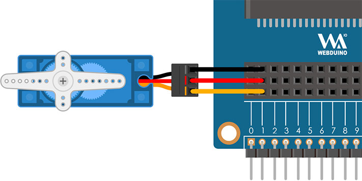

# 伺服马达

伺服马达会依照指示命令动作，由程式控制马达的旋转角度，马达就会转几度，搭配各种不同的齿轮组合，就能实际应用在玩具、模型屋、机械夹臂...等领域，实现许多有趣好玩的创意。

> 如果要使用伺服马达功能，需搭配Web:Bit 扩充板，购买方式请参考：[Web:Bit 扩充板](https://store.webduino.io/products/webbit-extension-board?utm_source=webbit&utm_medium =article#_blank)

## 伺服马达 积木清单

伺服马达积木可以设定脚位以及指定旋转的角度 ( 0～180 度 )。

> *伺服马达积木必须搭配「开发板」积木，且不支援模拟器*，只支援 USB 与 Wi-Fi 控制。
> - USB 控制模式为「安装版编辑器」限定，请参考 [Web:Bit 编辑器](../index.html#software)
> - Wi-Fi 模式需要开发板连接 Wi-Fi，请参考 [Web:Bit 硬体开发板 ( 初始化设定 )](../info/setup.html)

## 伺服马达 接线图

将伺服马达的橘色线 ( 讯号线 ) 接在 Web:Bit 扩充板的 1 号脚，红色线接到 3.3V，棕色线接到 GND。

> 注意，因 Web:Bit 扩充板输出电压为 3.3V，请确认伺服马达为支援 3.3V 的型号。

## 改变旋转角度

使用「点击小怪兽」的积木，设定点击绿色小怪兽时伺服马达旋转至 180 度，点击红色小怪兽时伺服马达旋转至 0 度，程式执行后，就可以透过滑鼠点击小怪兽控制伺服马达。

