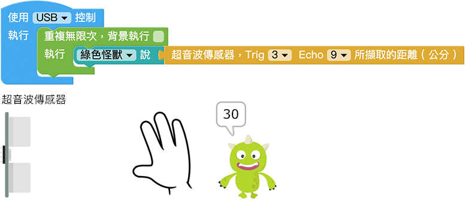

# 超音波传感器

超音波传感器主要用来侦测距离，透过发送的超音波碰撞到物体之后反射回来的时间差，就能计算超音波传感器与相对应物体之间的距离，不过因为超音波有指向性，如果今天受测的物体是倾斜的，超音波可能就会被反弹到别的地方，或是今天待测物会吸收声波，可能测出来的距离就会有不准确的情形发生。

> 如果要使用超音波传感器功能，需搭配Web:Bit 扩充板，购买方式请参考：[Web:Bit 扩充板](https://store.webduino.io/products/webbit-extension-board?utm_source= webbit&utm_medium=article#_blank)

## 超音波传感器 积木清单

超音波传感器的积木可以设定 Trig 和 Echo 的脚位，脚位数字对应实际的接线，执行后会取得侦测到的距离 ( 公分 )。

> *超音波传感器积木必须搭配「开发板」积木，且不支援模拟器*，只支援 USB 与 Wi-Fi 控制。
> - USB 控制模式为「安装版编辑器」限定，请参考 [Web:Bit 编辑器](../index.html#software)
> - Wi-Fi 模式需要开发板连接 Wi-Fi，请参考 [Web:Bit 硬体开发板 ( 初始化设定 )](../info/setup.html)

## 超音波传感器 接线图

将超音波传感器 HC-SR04 的 Trig 接在 Web:Bit 扩充板的 3 号脚，Echo 接到 9 号脚，VCC 接到 3.3V，GND 接到 GND。

## 即时侦测距离

将超音波撷取距离的积木，放在「重复无限次」的积木里，下图的程式积木执行后，用手或遮蔽物靠近或远离超音波传感器，小怪兽就会即时讲出所侦测的距离。

## 不同距离显示不同颜色

如果搭配「逻辑」和「矩阵LED」的积木，也能实现不同距离显示不同图案颜色的效果，下图的程式积木执行后，用手或遮蔽物靠近或远离超音波传感器，除了小怪兽就会即时讲出所侦测的距离，当距离小于20 公分时矩阵LED 会出现红色爱心，否则就是绿色的音符。

