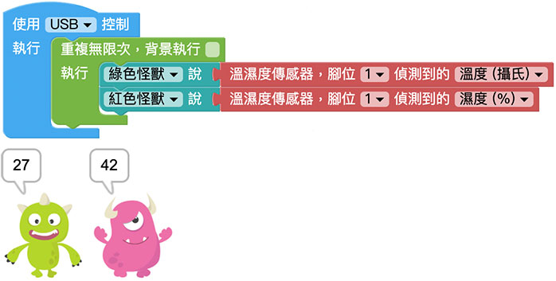

# 温湿度感测器

温湿度感测器可以侦测外界环境的温湿度变化，在 Web:Bit 扩充套件包的温湿度感测器型号是 DHT11，湿度测量范围是 20%～95% ( 请勿放入水中 )，温度测量范围是 0 度 C ～ 50 度 C ( 请勿高温烧烤 )，若再搭配 Google 试算表作为简单的资料库，就能实现定时纪录温湿度的功能。

> 如果要使用温湿度感测器，需搭配 Web:Bit 扩充板，购买方式请参考：[Web:Bit 扩充板](https://store.webduino.io/products/webbit-extension-board?utm_source=webbit&utm_medium=article#_blank)

## 温湿度感测器 积木清单

温湿度感测器积木可以透过指定的脚位，读取温度 ( 摄氏 ) 与湿度 ( % )。

## 温湿度感测器 接线图

将扩充套件包里的温湿度感测器的 S 连接 Web:Bit 开发板 1 号脚，VCC 连接 3.3V，GND 连接 GND。

## 小怪兽显示温湿度

分别将绿色和红色「小怪兽说话」的积木放入「重复无限次」的积木里，再将「温湿度传感器，脚位 X 侦测到的温度」连接绿色小怪兽积木，将「温湿度传感器，脚位 X 侦测到的湿度」连接红色小怪兽积木，程式执行后，就会看见绿色小怪兽讲出温度，红色小怪兽讲出湿度。

## Web:Bit 跑马灯显示温湿度

如果将上方范例的小怪兽换成矩阵 LED 跑马灯，就可以透过跑马灯依序显示红色的温度数值和蓝色的湿度数值。

如果觉得积木长度太长，可以在积木上方按压滑鼠右键，若出现「多行输入」表示该积木可以换行显示。

