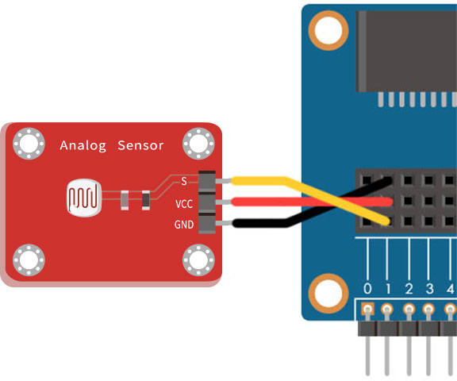

# 光敏电阻

光敏电阻常见于小夜灯里面，光敏电阻主要是利用光电导效应的一种特殊的电阻，当有光线照射时，电阻内原本处于稳定状态的电子受到激发，成为自由电子。所以光线越强，产生的自由电子也就越多，电阻就会越小，透过会变化的电阻值，进一步产生输出强弱讯号。

> 如果要使用光敏电阻，需搭配 Web:Bit 扩充板，购买方式请参考：[Web:Bit 扩充板](https://store.webduino.io/products/webbit-extension-board?utm_source=webbit&utm_medium=article#_blank)

## 光敏电阻 积木清单

光敏电阻积木可以透过指定的脚位，读取外在光线的数值 ( 0～1 的小数点数值 )

## 光敏电阻 接线图

将扩充套件包里的光敏电阻的 S 连接 Web:Bit 开发板 1 号脚，VCC 连接 3.3V，GND 连接 GND。

> 如果要使用光敏电阻，需搭配 Web:Bit 扩充板，购买方式请参考：[Web:Bit 扩充板](https://store.webduino.io/products/webbit-extension-board?utm_source=webbit&utm_medium=article#_blank)

## 小怪兽显示光线数值

将「小怪兽说话」的积木放入「重复无限次」的积木里，再将「光敏电阻，脚位 X 侦测到的数值」连接小怪兽积木，程式执行后，就会看见小怪兽讲出光线的数值，环境越亮数字越大 ( 最大 1 )，反之数字越小 ( 最小 0 )。

使用「四舍五入」搭配「尺度转换」的积木，能将侦测到 0～1 的小数点数值，转换为 0～1000 的整数。( 亦可转换成任意区间的数值 )，程式执行后，就会看见刚刚的小数点数值，已经转换成整数了。

## 小夜灯

延续上面的程式，搭配「逻辑」的积木，判断数值小于 0.3 时，让 Web:Bit 的 LED 矩阵显示红色爱心，反之大于等于 0.3 的时候熄灯，程式执行后，用手遮蔽光敏电阻，就会看见小夜灯的效果。

> 范例：[小夜灯](https://webbit.webduino.io/blockly/?demo=default#Jy1dv1BmlxZ3l#_blank)

