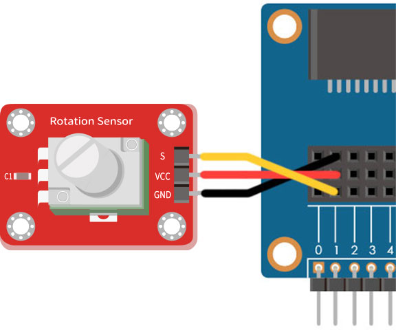
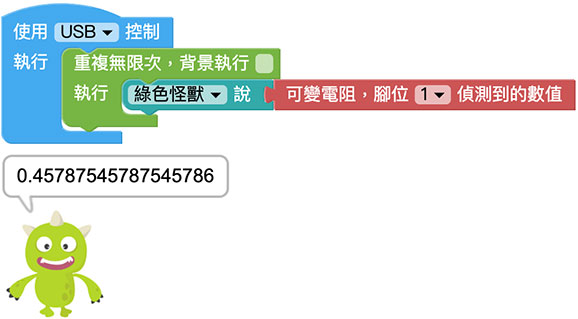
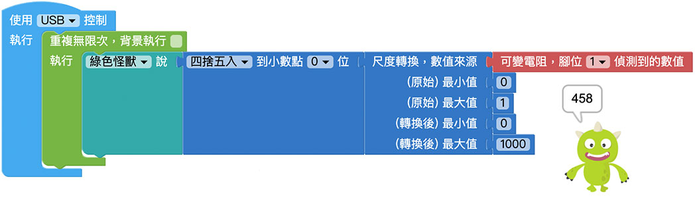
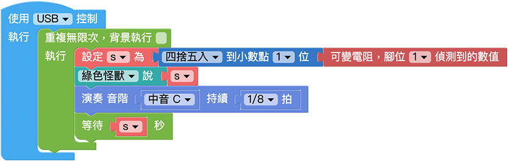

# 可变电阻

可变电阻是种可以经由滑动，而改变滑动端与两个固定端之间电阻值的电子零件，可变电阻通常具有三个端子，其中有两个是固定接点以及一个滑动接点，不少生活中的电器都能看见可变电阻的身影，例如随身听的音量大小旋钮、可以调整亮度的电灯开关...等，此外通常在转到最小的一侧，还会附带关闭电源的功能。

> 如果要使用可变电阻，需搭配 Web:Bit 扩充板，购买方式请参考：[Web:Bit 扩充板](https://store.webduino.io/products/webbit-extension-board?utm_source=webbit&utm_medium=article#_blank)

## 可变电阻 积木清单

可变电阻积木可以透过指定的脚位，读取旋钮转动的数值 ( 0～1 的小数点数值 )

## 可变电阻 接线图

将扩充套件包里的可变电阻的 S 连接 Web:Bit 开发板 1 号脚，VCC 连接 3.3V，GND 连接 GND。

## 小怪兽显示可变电阻数值

将「小怪兽说话」的积木放入「重复无限次」的积木里，再将「可变电阻，脚位 X 侦测到的数值」连接小怪兽积木，程式执行后，旋转可变电组旋钮，就会看见小怪兽讲出对应的数值，往某一侧旋转会发现数字变大 ( 最大 1 )，反之数字会变小 ( 最小 0 )。

使用「四舍五入」搭配「尺度转换」的积木，能将侦测到 0～1 的小数点数值，转换为 0～1000 的整数。( 亦可转换成任意区间的数值 )，程式执行后，就会看见刚刚的小数点数值，已经转换成整数了。

## 可变电阻调整蜂鸣器播放速度

将上面的程式做点变化，使用「变数」积木纪录四舍五入到小数点一位的可变电组数值，并将这个变数设定为回圈的「等待时间」，接着在每次回圈执行时让蜂鸣器播放声音，程式执行后，转动旋钮，就会听见蜂鸣器播放的速度有所不同。

> 范例：[可变电阻调整蜂鸣器播放速度](https://webbit.webduino.io/blockly/?demo=default#a355lAvP07l3m#_blank)

