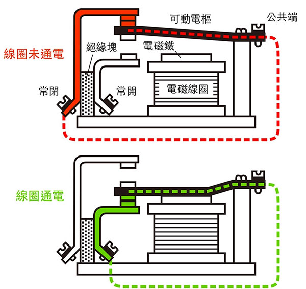
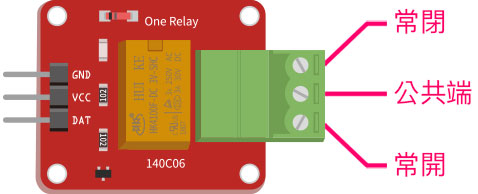
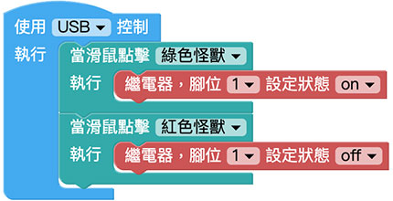

# 继电器

继电器是一种电子控制器件，它具有控制系统和被控制系统，通常应用于自动控制电路中，是用较小的电流去控制较大电流的一种「自动开关」，本篇教学会介绍如何透过 Web:Bit 开发版控制继电器，做出利用网页控制的智慧插座或自动开关。

> 如果要使用继电器，需搭配 Web:Bit 扩充板，购买方式请参考：[Web:Bit 扩充板](https://store.webduino.io/products/webbit-extension-board?utm_source=webbit&utm_medium=article#_blank)

## 继电器 积木清单

继电器积木可以设定脚位以及指定状态为 ON 或 OFF。

## 继电器 接线图

继电器的内部构造有一个电磁铁，在没有讯号提供时，内部的簧片会在上方，这时候「常闭」与「公共端」是通路，「常开」和「公共端」是断路，当电磁铁透过讯号通电，就会将内部的簧片往下吸附，此时「常闭」与「公共端」变成断路，「常开」和「公共端」变成通路，借由这个方式，我们就可以很容易的控制电器用品的开和关。

将扩充套件包里的继电器浅绿色的区块放在右侧 ( 如下图 )，从上而下方别是「常闭」、「公共端」和「常开」。

将欲控制的灯泡电源负极切成两半，一端连接继电器的「公共端」和插座，一端连接继电器的「常开」和灯泡，继电器的另一端 DAT 讯号脚连接 Web:Bit 扩充板的 1 号脚，VCC 连接 3V3，GND 连接 GND。

## 点击小怪兽控制继电器

放入「当滑鼠点击怪兽」的积木，设定点击绿色怪兽就会将继电器状态设定为 ON，点击红色怪兽时将继电器状态设定为 OFF，执行程式后，就可以点击小怪兽来控制继电器。

> 范例：[点击小怪兽控制继电器](https://webbit.webduino.io/blockly/?demo=default#rybdKvQOGNKqk#_blank)

## 使用 Web:Bit 按钮开关控制继电器

如果要使用 Web:Bit 开发板的按钮控制继电器，可以将上方小怪兽的积木，换成按钮开关的积木，按下 A 的时候会将继电器状态设定为 ON，按下 B 就设定为 OFF )，执行程式后就可以透过开发板的按钮开关来控制继电器。

> 范例：[使用 Web:Bit 按钮开关控制继电器](https://webbit.webduino.io/blockly/?demo=default#EqdrzX5mr86y#_blank6)

