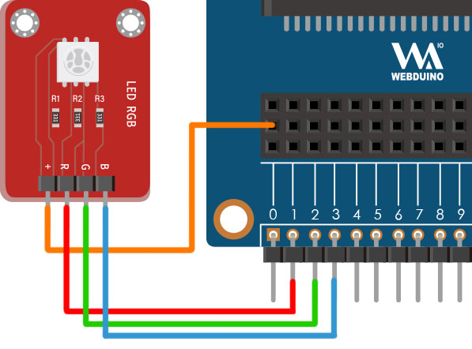

# 三色 LED

三色 LED 是由红、绿、蓝，三种不同颜色的 LED 所组成，因此可以发出最少三种颜色的光，也由于三色 LED 内部含有三颗 LED 灯，所以它具有 VCC、R、B、G 四支针脚，我们也可以分别控制个个颜色的强弱，进一步达到混合颜色的效果。

> 如果要使用三色 LED，需搭配 Web:Bit 扩充板，购买方式请参考：[Web:Bit 扩充板](https://store.webduino.io/products/webbit-extension-board?utm_source=webbit&utm_medium=article#_blank)

## 三色 LED 积木清单

三色 LED积木可以设定红色、绿色、蓝色的脚位，以及指定要呈现的颜色。

## 三色 LED 接线图

使用扩充套件包的三色 LED 模组，将 VCC 连接 Web:Bit 扩充板的 3V3，R 连接 1 号脚，G 连接 2 号脚，B 连接 3 号脚。

## 点击小怪兽改变三色 LED 颜色

放入「当滑鼠点击怪兽」的积木，设定点击绿色怪兽就会显示绿色、点击红色怪兽显示红色、点击绿色怪兽显示绿色、点击蓝色怪兽显示蓝色，程式执行后，点击对应的怪兽就会出现对应的颜色。

> 范例：[点击小怪兽改变三色 LED 颜色](https://webbit.webduino.io/blockly/?demo=default#YqKrZ8QQJEKR4#_blank)

