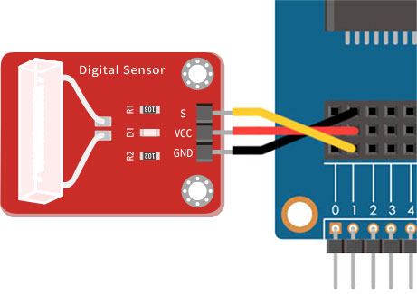
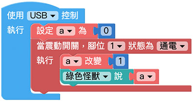

# 震動開關

震動開關的結構裡有一個金屬導電彈簧以及金屬導電腳，金屬彈簧延伸到塑膠外殼外部是一條比較細的金屬線，因此在晃動的時候，內部互相接觸進而短路導電，利用震動的方式，控制電路的開或關。

> 如果要使用震動開關，需搭配 Web:Bit 擴充板，購買方式請參考：[Web:Bit 擴充板](https://store.webduino.io/products/webbit-extension-board?utm_source=webbit&utm_medium=article#_blank)

## 震動開關 積木清單

震動開關的積木可以指定腳位，讀取是否有觸發震動，屬於持續偵測的積木，不需要搭配迴圈就能即時偵測。

## 震動開關 接線圖

將擴充套件包裡的震動開關的 S 連接 Web:Bit 開發板 1 號腳，VCC 連接 3.3V，GND 連接 GND。

## 小怪獸顯示震動幾次

首先放入一個變數預設為 0，接著放入「當震動開關，腳位 X 狀態為通電」的積木，在偵測到通電 ( 發生震動 ) 時，使用「變數改變」的積木將變數的數值加 1，並透過綠色怪獸顯示變數數值，程式執行後，用手觸碰震動開關，就會看見數值不斷累加。

> 範例：[小怪獸顯示震動幾次](https://webbit.webduino.io/blockly/?demo=default#6yY4W26xOb03w#_blank)

