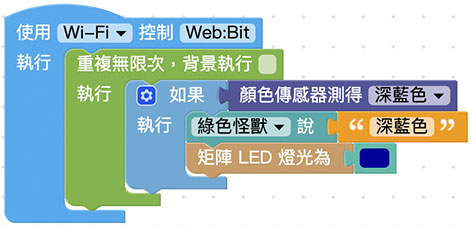

# Web:Bit MoonCar 颜色识别

MoonCar 除了「辨识（黑色）路径轨迹」以外，MoonCar 还具备了「地板颜色识别」功能。搭配套件中所附赠（或自备）的颜色卡片，就可以透过这项功能，来让 MoonCar 识别出当下所在（区域）位置，进而让 MoonCar 做出相对应的处理。

## 积木清单

## 基本识别功能
这个聪明的颜色识别功能很简单，透过 MoonCar 以底盘前方左侧的颜色感测器模组，搭配回圈和逻辑积木，来判断小车目前是否正行驶在指定颜色的地板（或卡片）上。

## 简单应用
由于 MoonCar 小车现在可以识别出地板的颜色，因此我们就可以搭配小车的移动控制积木，来把地板颜色当成用来控制小车行动的指令。

例如：底下所示范的，就是类似交通号志般，让小车「绿色行，红色停」的简单应用。

