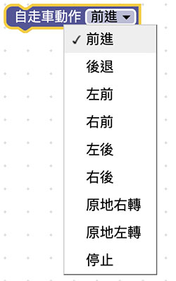

# Web:Bit MoonCar 基本控制

MoonCar 是专门为 Web:Bit 开发板所设计，内建多种功能元件，可用来开发各种应用的自走车。这边文章可以让我们先来了解 MoonCar 的基本控制方式，并透过画面上的小怪兽们来操控它。

> Wi-Fi 模式需要开发板连接 Wi-Fi，请参考： [Web:Bit 硬体开发板 ( 初始化设定 )](https://webbit.webduino.io/tutorials/doc/zh-cn/education/info/setup.html)。

## 积木清单

透过基本动作操控积木，可以用来操控车子的前后左右等动作。

另一个可用来设定轮子马达转速的积木，除了可以因应需要调整车子移动速度外，还可以因为特殊状况需要，来个别设定左右轮的马达转速。

## 控制小车动作（ 使用小怪兽 ）

为了制作一个可以简单操控 MoonCar 动作的互动介面，我们会先把各个怪兽之间的位置摆放如下：

接着我们可以运用「怪兽控制」里的「滑鼠触碰怪兽」的积木，来设计出 MoonCar 的操控介面。

执行后，你就可以透过把滑鼠移到各怪兽身上的方式，来操控 MoonCar 的动作。当滑鼠游标从怪兽身上移开时，MoonCar 就会停止。

> - 前进：绿色怪兽
>
> - 后退：黄色怪兽
>
> - 左转：红色怪兽
>
> - 右转：蓝色怪兽
