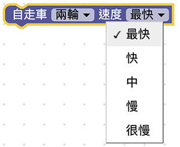
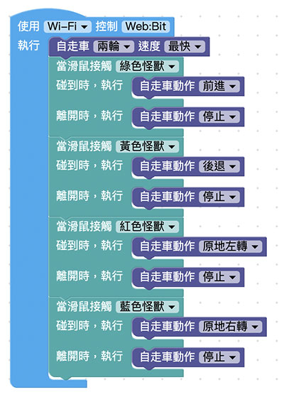

# Web:Bit MoonCar 基本控制

MoonCar 是專門為 Web:Bit 開發板所設計，內建多種功能元件，可用來開發各種應用的自走車。這邊文章可以讓我們先來了解 MoonCar 的基本控制方式，並透過畫面上的小怪獸們來操控它。

> Wi-Fi 模式需要開發板連接 Wi-Fi，請參考： [Web:Bit 硬體開發板 ( 初始化設定 )](https://webbit.webduino.io/tutorials/doc/zh-tw/education/info/setup.html)。

## 積木清單

透過基本動作操控積木，可以用來操控車子的前後左右等動作。

另一個可用來設定輪子馬達轉速的積木，除了可以因應需要調整車子移動速度外，還可以因為特殊狀況需要，來個別設定左右輪的馬達轉速。

## 控制小車動作（ 使用小怪獸 ）

為了製作一個可以簡單操控 MoonCar 動作的互動介面，我們會先把各個怪獸之間的位置擺放如下：

接著我們可以運用「怪獸控制」裡的「滑鼠觸碰怪獸」的積木，來設計出 MoonCar 的操控介面。

執行後，你就可以透過把滑鼠移到各怪獸身上的方式，來操控 MoonCar 的動作。當滑鼠游標從怪獸身上移開時，MoonCar 就會停止。

> - 前進：綠色怪獸
>
> - 後退：黃色怪獸
>
> - 左轉：紅色怪獸
>
> - 右轉：藍色怪獸
