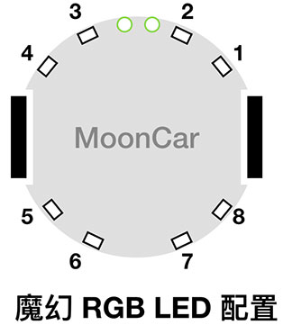
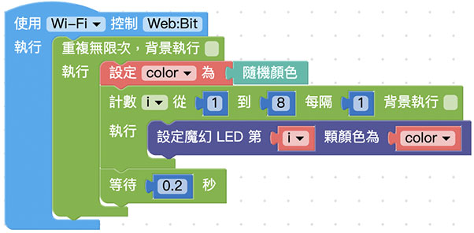

# Web:Bit MoonCar 魔幻 LED

MoonCar 除了 Web:Bit 内建的 5 x 5 矩阵 LED 外，在 MoonCar 小车的四周还额外增加了 8 颗全彩 LED，以便让大家可以依照需要，做出更炫的灯号效果。

## 积木清单

## 基本亮灯控制

就和原本 Web:Bit 内建的 矩阵 LED 那样，若希望哪颗 LED 呈现出某种颜色，就只要直接指定相对应的 LED 编号和颜色即可。若要将 8 颗 魔幻 LED 同时指定成同一种颜色，则可以搭配重复回圈即可。

另外，再搭配变数和数学的随机积木，就可以让 魔幻 LED 呈现出不断以各种颜色来进行闪烁的魔幻效果！

