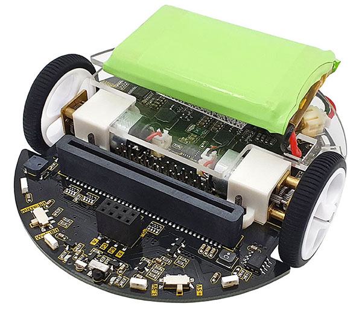
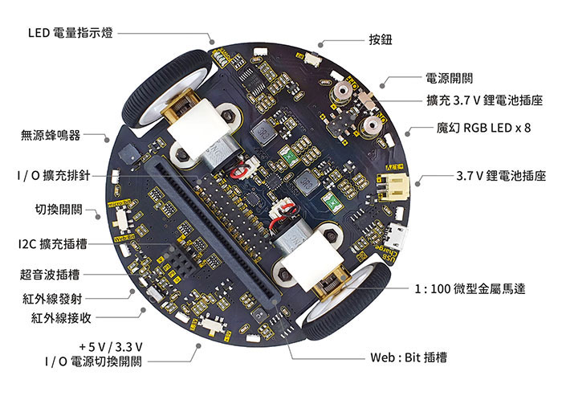
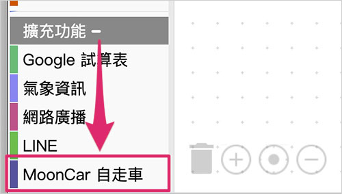

# Web:Bit MoonCar 登月小车

Web:Bit MoonCar（简称「登月小车」）是由 Webduino 和 iCShop 合作开发，是专门为 Web:Bit 开发板所设计的自走车，内建巡迹功能、颜色感测、红外线发射接收与按钮，结合 Web:Bit 就能让点矩阵显示各种颜色的图案。前方保留超音波的脚位，可实作自动避障功能。透过 Web:Bit 教育版就能轻松实现更多有趣的控制方式！

> 更多 Web:Bit 教学资源参考： [Web:Bit 教育版](https://webbit.webduino.io/tutorials/doc/zh-cn/education/index.html)。

## 产品照片

## MoonCar 元件介绍

### 上方元件

### 下方元件

## 使用扩充积木

若要撰写 MoonCar 自走车的相关控制程式或应用，请记得要先启用位于「扩充」功能列表的「物联网开发套件」分类底下的「MoonCar 自走车」扩充积木。

## WiFi 无线操控

由于绝大多数的遥控车都是使用无线控制方式，所以使用 MoonCar 之前，我们得先确定自己可以透过无线 WiFi 的模式来控制 Web:Bit 开发板。

> 这部分请参考： [Web:Bit 硬体开发板 ( 初始化设定 )](https://webbit.webduino.io/tutorials/doc/zh-cn/education/info/setup.html)。

