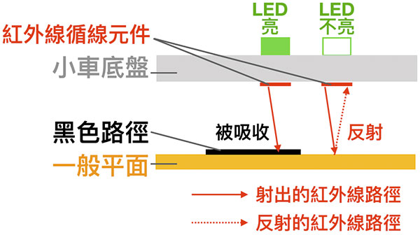

# Web:Bit MoonCar 循跡自走

「循跡自走」是許多自動化智慧小車的基礎，在 MoonCar 當中，我們只要透過幾個簡單的積木，就可以實現出這樣的功能。這樣，我們就可以更進一步地去規劃或設計出更複雜或豐富的應用。

## 積木清單

## 基本循跡功能

### 循跡概要

「循跡」這個功能，是透過 MoonCar 底盤前方的那兩個 IR 循線感測器來感應路面上的路線狀況。這兩個循線感應器，會根據路面狀況產生反應，並在 MoonCar 底盤上方相對應位置的 綠色 LED 反映出相對應的結果。

簡單來說，左右這兩個循線感應器，會往下發出垂直於路面的紅外光（IR），來偵測目前是否在「黑色路徑」上：如果是（走在黑色路徑上）的話，底盤上方相對應的 綠色 LED 就會亮起，否則就不亮。

#### 原理解說

黑色會吸收紅外光線，其他顏色則會反射紅外光。因此，可用黑色筆或膠帶來畫（貼）出希望行走的軌跡。實作時，我們可以先用（套件附贈的）黑色膠帶，在地面或桌面貼出要讓 MoonCar 行走的路徑。

直接使用循跡積木，並將車子放在路徑上，就可以直接執行程式了。

執行時，MoonCar 應該會順利地循著你所設計的路線行走。

> 在這個「循跡積木」裡，自走車的「保持不變」是指示小車持續進行原本的（前進、後退、左轉、右轉..等）任何動作。初期若因為速度過快導致 MoonCar 跑出原本的設計路線的話，可以先透過「速度設定」積木來進行調整。