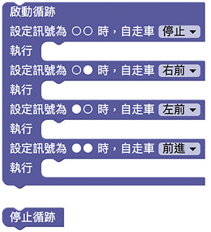
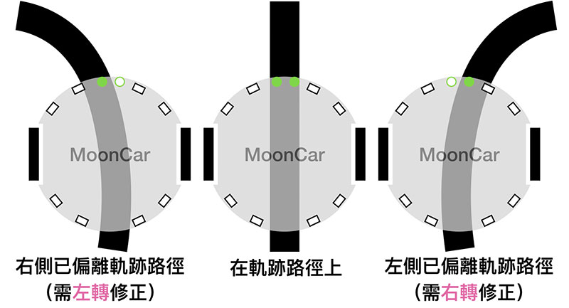
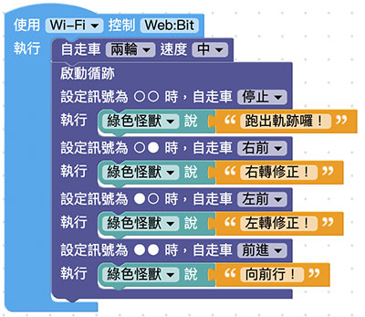

# Web:Bit MoonCar 循迹自走

「循迹自走」是许多自动化智慧小车的基础，在 MoonCar 当中，我们只要透过几个简单的积木，就可以实现出这样的功能。这样，我们就可以更进一步地去规划或设计出更复杂或丰富的应用。

## 积木清单

## 基本循迹功能

### 循迹概要

「循迹」这个功能，是透过 MoonCar 底盘前方的那两个 IR 循线感测器来感应路面上的路线状况。这两个循线感应器，会根据路面状况产生反应，并在 MoonCar 底盘上方相对应位置的 绿色 LED 反映出相对应的结果。

简单来说，左右这两个循线感应器，会往下发出垂直于路面的红外光（IR），来侦测目前是否在「黑色路径」上：如果是（走在黑色路径上）的话，底盘上方相对应的 绿色 LED 就会亮起，否则就不亮。

#### 原理解说

黑色会吸收红外光线，其他颜色则会反射红外光。因此，可用黑色笔或胶带来画（贴）出希望行走的轨迹。实作时，我们可以先用（套件附赠的）黑色胶带，在地面或桌面贴出要让 MoonCar 行走的路径。

直接使用循迹积木，并将车子放在路径上，就可以直接执行程式了。

执行时，MoonCar 应该会顺利地循着你所设计的路线行走。

> 在这个「循迹积木」里，自走车的「保持不变」是指示小车持续进行原本的（前进、后退、左转、右转..等）任何动作。初期若因为速度过快导致 MoonCar 跑出原本的设计路线的话，可以先透过「速度设定」积木来进行调整。