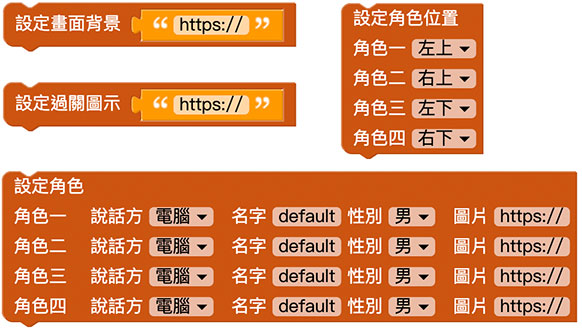
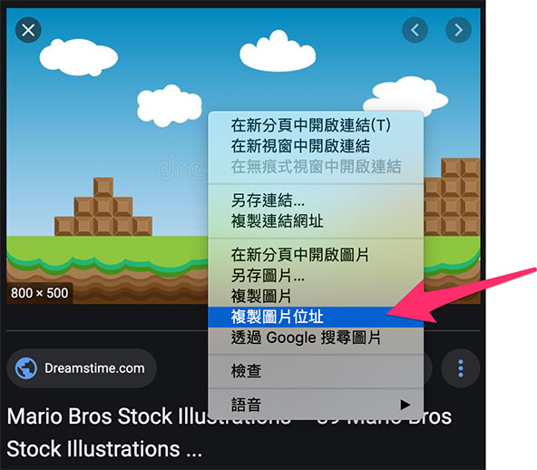
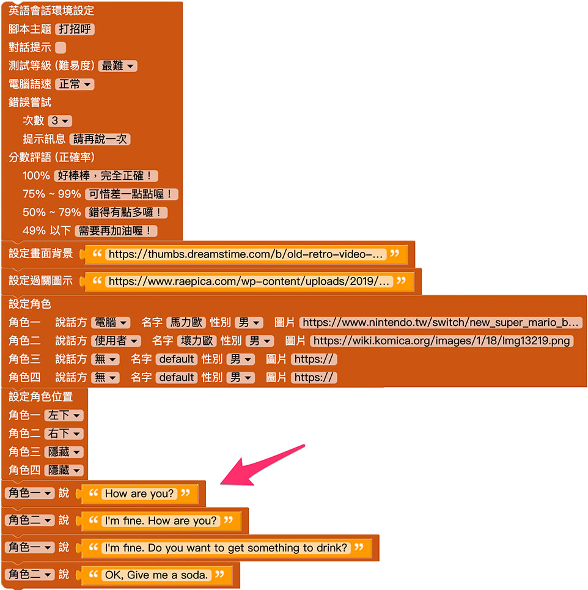
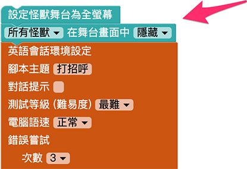
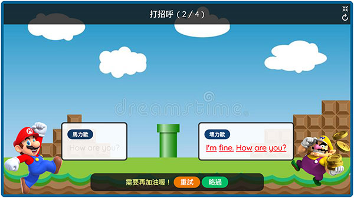

# 英语会话 ( 使用程式积木 )

在 Web:Bit 教育版的扩充功能里，可以自己设计英语会话的游戏与应用情境，部署之后，在小怪兽舞台产生与众不同的互动效果，这篇文章将会介绍透过程式积木的方法设定英语会话。

延伸 [英语会话 ( 使用 Google 试算表 )](english-spread-sheet.html)，进入 Web:Bit 教育版后，开启英语会话扩充功能，在左侧积木清单的扩充功能里，选择「英语会话」的积木，除了第一块「载入 Google 试算表关卡模板」是独立运作，其他的积木能做出互动式的英语会话的互动情境，以下将会介绍这些积木以及相关用法。

## 积木 - 环境设定 ( 一次性 )

「英语会话环境设定」的积木，在一个英语会话的程式里「*只能使用一次*」，主要作用为设定整体英语会话的环境，包含主题名称、提示、等级、语速、尝试次数、分数评语的相关设定选项。

## 积木 - 关卡设定 ( 不同关卡可套用不同设定 )

「画面背景」、「过关背景」、「角色设定」和「角色位置」这四个积木，会在不同的关卡开始之前进行设定，例如机场的关卡就可套用机场的背景以及空服员的角色，面包店的关卡可以套用烘培坊的背景和厨师的角色，依此类推。

## 积木 - 关卡内容  ( 不同关卡可使用不同内容 )

设定环境和关卡之后，透过「角色说...」的积木，就能让角色依序发声对话，「*如果角色是使用者，则会要求使用者透过麦克风朗读语音*」，藉由人工智慧判断正确率，此外亦可透过「取得失败次数」和「结束会话」，进行更多的互动效果。

## 设计一段英语会话

放入环境设定积木 ( 全部采用预设值 ) 以及背景图片的积木。

前往 Google 图片搜寻，搜寻一张理想的背景图 ( 范例搜寻是 mario background )，点击图片之后，用滑鼠在图片上按右键，复制图片的网址。

回到背景图片的栏位，贴上背景图片的网址。 ( 因为是 Google 图片搜寻，所以相关程式请勿商业使用，除非确认该图片可以商业使用 )

放入过关图片的积木，Google 图片搜寻 good job，找到合适的图片复制网址并贴到栏位中。

放入角色设定的积木，设定角色 1 是名为马力欧的电脑，角色 2 是名为坏力欧的使用者，并隐藏角色 3 和 4 。

前往 Google 图片搜寻马力欧的图片，使用「工具」搜寻「透明」的图片。

找到合适的图片，复制网址，贴上积木对应的栏位。

同样的做法，搜寻坏力欧的背景透明的图片，复制网址，贴上积木对应的栏位。

放入设定角色位置的积木，设定角色 1 在左下，角色 2 在右下，角色 3 和 4 设定为隐藏。

放入角色对话的积木，输入要对话的内容。

最后在积木一开始的位置，放入「设定怪兽舞台为全萤幕」以及「所有怪兽隐藏」的积木。

程式执行后，就可以进行相关的英语对话练习。

> 范例参考：[英语会话 ( 使用程式积木 )](https://kebbi-iot.webduino.io/webbit/?demo=default#rybdKaz5WOaqk)

