# Web:Bit 扩充功能：Google 简报

Google 简报是 Google 提供的免费服务，学生们可以透过 Google 简报来学习演讲报告、整合学习内容、美术设计、团队协作等等。而 Web:Bit 简报积木更能够搭配程式积木，使用声控、光感、按钮等物联网功能控制简报，在学习物联网同时利用 Google 简报展现成果。

## 显示 Google 简报

「显示 Google 简报」积木只需要填入简报网址，就能在小怪兽舞台中显示简报画面。

### 共用试算表

在使用 Google 简报积木前，需要先建立简报，并将简报开启共用。

1. 登入 Google 帐号，在云端空间中按下「右键」，选择「Google 简报」。

    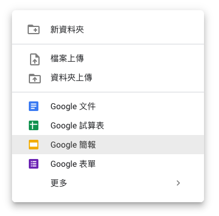

2. 建立简报后，编辑标题和内容。

    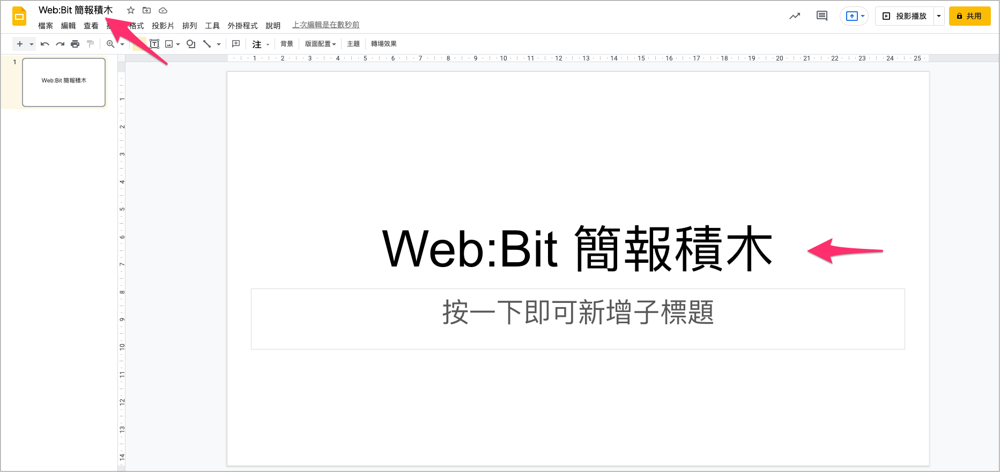

3. 点击右上角「共用」，将「知道连结的使用者」设定为「检视者」，点击「完成」。

    

    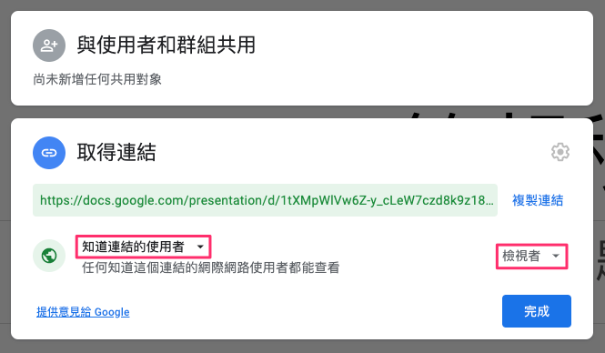

4. 点击「复制连结」，这段连结需要贴入积木中，按下「完成」，即完成简报设定。

    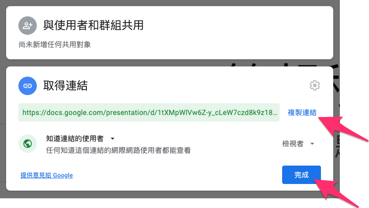

### 积木使用

1. 将复制的简报连结贴入「显示 Google 简报」积木。

    

2. 按下执行，即可看到在小怪兽舞台显示简报。

   

3. 也可以点击「展开」按钮，将简报全萤幕显示。

    

    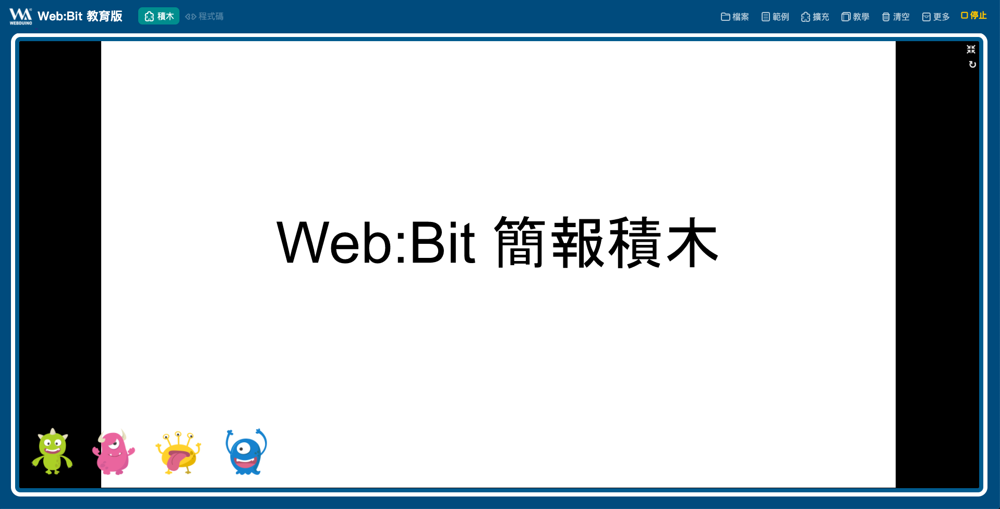
    
## 回到上一页 / 进入下一页

「回到上一页」积木及「进入下一页」积木可以控制简报的页面切换。

### 范例：小怪兽控制简报

<!-- https://testwbit.webduino.tw/blockly/#rybb16bpDnmyk -->

使用「滑鼠点击小怪兽」积木搭配「回到上一页」积木及「进入下一页」积木，就可以做到点击绿色、红色小怪兽控制简报页码切换。

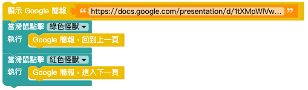

## 前往页码

「前往页码」积木可以直接前往指定的页码。

### 范例：小怪兽简报控制器

<!-- https://testwbit.webduino.tw/blockly/#03lYm9mYZ1Nyv -->

延续上一个范例，增加一块「滑鼠点击小怪兽」积木，搭配「前往页码」积木，控制简报前往第一页。

## 目前页数 / 全部页数

「目前页数」积木及「全部页数」积木可以显示简报目前的页数以及简报的全部页数。

### 范例：小怪兽说页码

<!-- https://testwbit.webduino.tw/blockly/#jqwKOY8YDNxqO -->

1. 延续上一个范例。

    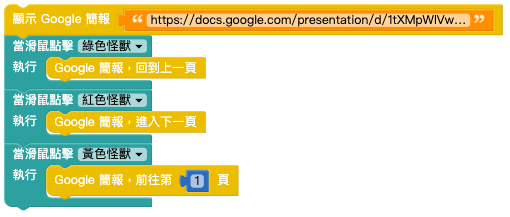

2. 使用「字串」积木搭配「目前页数」积木及「全部页数」积木，组成下图。

    

3. 搭配「小怪兽说话」积木、「重复」积木，让小怪兽重复说出页数。

    

4. 组合积木如下图，按下执行，当点击小怪兽切换页面时，可以看到小怪兽会说出现在的页数。

   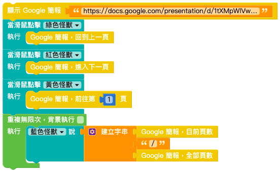

   

## 进阶范例：光感简报控制器

只要挥动手，就能藉由侦测光线来控制简报页码切换。

1. 使用「开发板」积木输入开发板 DeviceID，放入「显示 Google 简报」积木，并输入简报网址。

    > 可以使用「模拟器」来执行，若要符合物联网情境，建议使用 Web:Bit 开发板。

   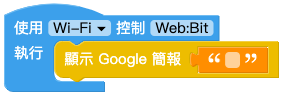

2. 使用「目前页数」积木及「全部页数」积木，搭配「文字」积木做出如下：

    

3. 使用「逻辑」积木、「侦测光线」积木、「回到上一页」积木。
如果左上亮度 < 100，执行简报回到上一页。

    > 因为各环境光线不同，需要依据现场调整光度数值。

   

4. 重复步骤 3. 做出：如果右上亮度 < 100，执行简报前往下一页。

    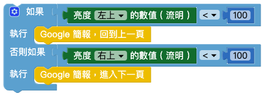

5. 使用「重复」积木让程式能够不断执行，完成后就可以侦测手部位置来控制简报。

    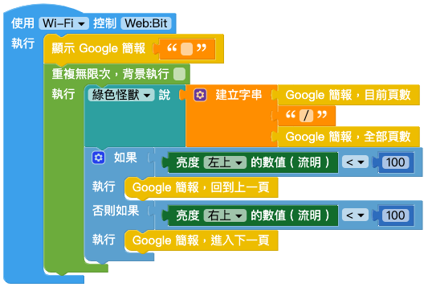
