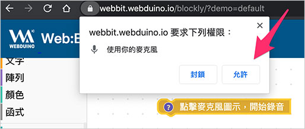
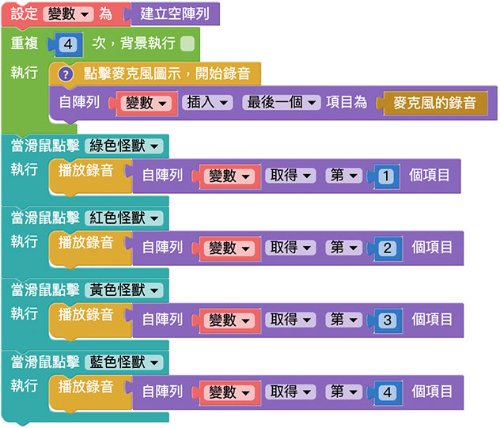

# Web:Bit 录音＆音量

因为 Web:Bit 教育版是透过浏览器运作，可以很轻松搭配电脑麦克风，借由麦克风录音或麦克风的音量大小变化，做出各种和声音有关的物联网互动。

## Web:Bit 录音＆音量积木清单

「录音＆音量」积木包含开始录音、播放录音、麦克风的录音和麦克风的音量四种。

## 点击麦克风图示，开始录音{{microphone01}}

「点击麦克风图示，开始录音」积木可以让使用者透过电脑麦克风录音。

这块积木在程式执行后，怪兽舞台会出现一个「麦克风图示」。

点击麦克风图示，启用电脑的麦克风授权，就可以开始录音。

开始录音后，麦克风图示会变成「红色闪烁」的麦克风，再次点击就可以停止录音。

麦克风积木在使用上有两点注意事项：

> - 录音时，积木流程会暂停，直到手动停止录音才会继续
>
> - 录音停止后，麦克风图示会消失，可透过「重复回圈」进行重复录音

## 播放录音＆麦克风的录音{{microphone02}}

「播放录音」积木搭配「麦克风的录音」积木，就能播放刚刚的录音档案。

举例来说，先放上「点击麦克风图示，开始录音」积木，接着放入「点击小怪兽」的积木，在点击小怪兽的时候，播放麦克风录音，程式执行后，先点击怪兽舞台的「麦克风图示」开始录音，再次点击麦克风图示结束录音，录音结束后，点击小怪兽，就会播放刚刚的录音档案。

搭配重复回圈、变数和阵列，就能够让每只小怪兽都讲出不同的录音，下面的例子透过「重复四次」的回圈，让阵列纪录四次录音档案，再依序设定点击不同小怪兽，播放不同录音档案。

> - 注意，每次执行录音时，都必须点击「麦克风图示」才会开始录音
>
> - 范例连结：[点击不同小怪兽播放不同录音](https://webbit.webduino.io/blockly/?demo=default#rybdKPnGJ5Mqk#_blank)

## 麦克风的音量{{microphone03}}

「麦克风的音量」积木可以取得麦克风目前的音量数值，数值范围是 0 ( 最小声 ) 到 100 ( 最大声 )。

「麦克风的音量」积木的使用必须搭配「重复回圈」，下面的范例透过重复无限次的回圈，搭配小怪兽，讲出目前麦克风的音量大小。

> 注意，若是第一次使用麦克风，需要启用电脑的麦克风授权。

