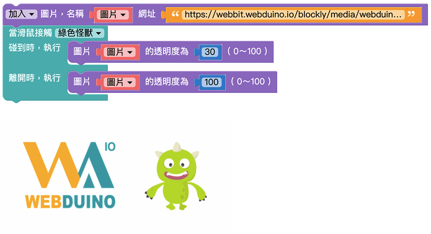

# Web:Bit 扩充功能：图片

扩充功能中的图片积木可以改变图片的样式及位置，并将图片直接显示在小怪兽互动舞台中，搭配 Web:Bit 教育版中的其它功能，能够对图片做出更多的互动，实践更多物联网应用。

## 图片积木清单

图片积木包含图片来源、图片样式、位置、互动、显示、还原预设值等积木。

## 加入＆更换图片{{picture-object01}}

「加入图片」积木及「更换图片」积木可以控制图片的来源网址，决定展示哪一张图片，并且能够将图片的名称用变数命名，藉由变数的命名让后面的积木轻松控制图片的样式和互动。

为了展示更换效果，加入「滑鼠点击小怪兽」积木，让执行的时候能够藉由点击小怪兽触发更换图片。
在积木执行内放入「更换图片」积木，将图片名称变数改为自己设定的名称，并更改图片网址，按下执行，就可以看到滑鼠点击小怪兽后舞台内的图片更换了。

 

 

> 一次可使用多个「加入图片」积木，但是不能将多张图片命名为同一个变数名称。

## 图片定位{{picture-object02}}

「图片定位」积木是以小怪兽互动舞台的左下角为原点 (0,0)，透过设定 x、y 的数值，将图片显示在 xy 座标中的位置。

 

设定 x 为 100、y 为 100，按下执行，可以看到 Webduino 图片在原点 ( 小怪兽舞台左下角 ) 往右 100、往上 100 的位置。

 

> - 因为位置的判定是以*图片的中心*为准，因此当「图片定位」积木设定成 *x 为 0、y 为 0* 时，图片的中心刚好位在小怪兽舞台的左下角 ( 座标的原点 )，所以画面中只会看到图片的1/4。
>
> - 若不使用「图片定位」积木，图片的预设位置会是：
    - x 座标 ( 图片中心的 x 座标 )：原始图片宽度的一半
    - y 座标 ( 图片中心的 y 座标 )：原始图片长度的一半 + 100
    - 例如 Webduino 图片的原始大小为 400*400，那预设座标就会是 (200,300)

## 图片移动{{picture-object03}}

「图片移动」积木能够控制图片往上下左右四个方向移动，也可以互相搭配，达成往右上、右下、左上、左下移动。透过搭配其它触发方式，可以设定在特定的时候触发图片移动。

 

放入 2 个「图片移动」积木，设定往下 200 点、往右 200 点，按下执行，可以看到图片往右下方移动。

 

## 图片大小{{picture-object04}}

控制图片大小的积木包含「图片尺寸设定」积木和「图片尺寸变化」积木，两种积木的差别在于「图片尺寸设定」积木是直接设定图片的尺寸大小，而「图片尺寸变化」积木则是根据当下的图片尺寸做改变。

- 「图片尺寸设定」积木：例如将图片*尺寸设定为 50%*，会显示图片宽度为*原始的 50%*。
- 「图片尺寸变化」积木：例如设定图片*尺寸变大 100 点*，会显示图片宽度为*当下宽度**加上** 100 点*。

范例是滑鼠触碰小怪兽让图片改变大小，离开小怪兽后图片恢复到原始大小。
先放入「滑鼠接触小怪兽」积木，设定：
- 碰到时，执行尺寸变大 150 点
- 离开时，执行尺寸设定为 100%

按下执行，使用滑鼠触碰小怪兽，可以看到图片变大；滑鼠离开时，图片恢复到原始的大小。

> - 在 Web:Bit 教育版中的图片尺寸是 **以宽度为基准**，若图片尺寸为 100 点，代表图片宽度为 100 点、高度为符合图片比例的数值。  
( 换句话说，积木中控制图片的尺寸等于是控制图片的宽度，并且图片不会因为尺寸改变而失真。 )
>
> - 前面介绍的图片位置的判定是以 *图片的中心* 为准，因此图片尺寸的改变并不会对图片位置造成影响。  
( 例如：100% 和 200% 的图片中心点会在相同位置 )

## 图片旋转{{picture-object05}}

控制图片大小的积木包含「图片旋转」积木和「图片左右旋转」积木，两种积木的差别在于「图片旋转」积木是以*原始图片*的角度作旋转；「图片左右旋转」积木是以*当下*图片的角度作旋转。

- 「图片旋转」积木：以*原始图片*的角度为基准，图片中心为圆心，顺时针旋转。
- 「图片右旋转」积木：以*当下*图片的角度为基准，图片中心为圆心，顺时针旋转。
- 「图片左旋转」积木：以*当下*图片的角度为基准，图片中心为圆心，逆时针旋转。

使用「图片旋转」积木设定 60 度，可以看到图片顺时针旋转 60 度。

若是想要达到不断触发旋转的效果，可以使用「怪兽控制」积木搭配「图片左右旋转」积木。
放入「滑鼠点击小怪兽」积木，设定执行使用「图片左旋转」积木 10 度。按下执行，可以看到每次点击小怪兽，图片都会逆时针旋转 10 度。

## 图片透明度{{picture-object06}}

「图片透明度」积木可以改变图片的透明度，数值可以是 0 ~ 100，0 为完全透明、100 为原始颜色 ( 透明度不变 )。

这里尝试将「图片透明度」积木搭配「怪兽控制」积木，让滑鼠触碰到绿色小怪兽的时候能够改变图片的透明度。
设定滑鼠触碰时，图片透明度为 30；滑鼠离开时，图片透明度为 100。按下执行，可以看到图片透明度会随着滑鼠触碰小怪兽而变化。

## 图片阶层{{picture-object07}}

「图片阶层」积木能够控制图片的上下顺序位置，并决定图片是否会被小怪兽遮蔽。

在预设情况下执行，图片会被小怪兽覆盖。
若放入「图片阶层」积木并设定*移到最上层*，执行后可以看到 Webduino 图片显示在小怪兽的上方。

## 滑鼠点击图片{{picture-object08}}

「滑鼠点击图片」积木能够决定点击图片的触发事件，在点击图片后执行动作。

> 滑鼠点击积木「*不需要放在重复回圈内*」就可重复侦测。

为了展示点击效果，加入「小怪兽讲话」积木，让执行的时候能够藉由点击图片让小怪兽讲话。
在「滑鼠点击图片」积木执行内放入「小怪兽讲话」积木，按下执行，滑鼠点击图片后就可以看到小怪兽说话了。

## 滑鼠触碰图片{{picture-object09}}

「滑鼠碰触图片」积木包含两个行为动作，分别是滑鼠碰触到图片要做什么事，以及滑鼠离开图片要做什么事。

> 注意，离开的行为一定会接续在碰触之后，滑鼠碰触积木「*不需要放在重复回圈内*」就可重复侦测。

下图的例子，在滑鼠碰触到 Webduino 图片时，图片尺寸会变大，滑鼠离开后图片又恢复原始大小。

## 图片数值{{picture-object10}}

图片数值包含 x、y 座标、长度、宽度、角度，可以用「图片数值」积木清楚知道自己对图片调整的数值，并且搭配其它积木显示出来。

先任意对图片调整到想要的样式，接着在后方放入「小怪兽讲话」积木，放入想让小怪兽说出的图片数值。
若是需要放入更多文字，可以利用「建立字串」积木同时显示更多文字。

## 显示隐藏图片{{picture-object11}}

「显示隐藏图片」积木和「图片透明度」积木不同，是直接将图片设定为显示或隐藏，选单内可以选择显示或隐藏图片。

将积木设定为显示，按下执行，可以看到 Webduino 图片正常显示。

将积木设定为隐藏，按下执行，可以看到原本的 Webduino 图片直接被隐藏。

## 图片还原预设值{{picture-object12}}

「图片还原预设值」积木可以把前面程式积木对图片做的任何变化都还原成预设值。

> 图片预设值：
> - x 座标 ( 图片中心的 x 座标 )：原始图片宽度的一半
> - y 座标 ( 图片中心的 y 座标 )：原始图片长度的一半 + 100
> - 大小：原始图片尺寸
> - 旋转：0 度 ( 360 度 )
> - 透明度：100
> - 阶层：预设 ( 小怪兽下方 )
> - 隐藏：正常显示

先用程式积木对图片做设定，让图片产生不同的样式变化。

在下方加入「图片还原预设值」积木，按下执行，可以看到刚刚做的变化设定都还原成未做任何变化的图片。

若是在「图片还原预设值」积木下方再加入其它积木，执行后就会再次改变图片样式。

