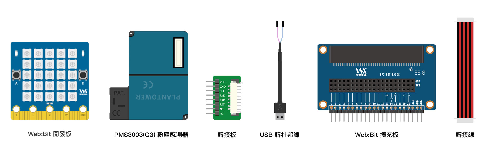
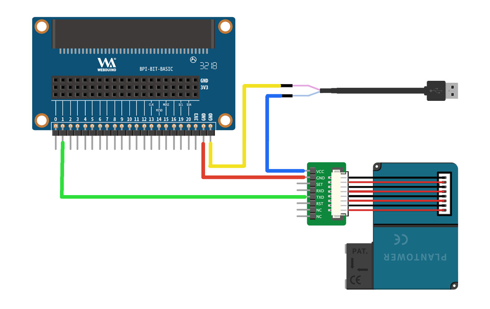
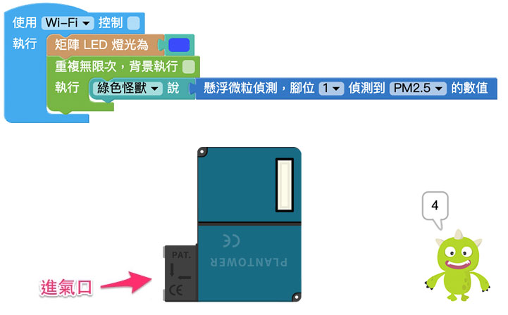

# Web:Bit 扩充功能：PM2.5 感测器

细悬浮微粒 ( particulate matter )，缩写 PM，是空气中飘散的微小颗粒物质。细悬浮微粒会经由鼻、咽、喉进入身体，并经由气管、支气管、血管被人体吸收，随着血液循环影响全身。  
使用 Web:Bit PM2.5 感测器积木配合粉尘感测器可以侦测到 PM2.5 及 PM1.0，透过程式积木的功能，能够清楚知道目前的空气品质，并且加以预防。

>- PM2.5：粒径范围在 2.5μm ( 微米，百万分之一公尺 ) 或以下的细悬浮微粒。
>
>- PM1.0：粒径范围在 1.0μm 或以下的细悬浮微粒，直径比 PM2.5 更小，又称为超细悬浮微粒。

## PM2.5 感测器 积木清单

PM2.5 感测器积木可以透过指定的脚位，读取 PM2.5 及 PM1.0。

## PM2.5 感测器 接线图

这里使用 PMS3003(G3) 粉尘感测器来侦测空气细悬浮微粒，需要用到 PMS3003(G3) 粉尘感测器、转接板、USB 转杜邦线、Web:Bit 扩充板、转接线。

> USB 转杜邦线可于电器相关商店自行购买，若有需求欢迎透过下方联络资讯联系我们。

将 PMS3003(G3) 粉尘感测器用转接线串接到转接板，再将转接板的脚位接到对应的 Web:Bit 脚位，由于 PMS3003(G3) 粉尘感测器需要供电 **5V**，因此需要使用 USB 转杜邦线供电。

- 转接板 VCC 接 USB 转杜邦线一端
- 转接板 GND 接 Web:Bit 扩充板 GND
- 转接板 TXD 接 扩充板脚位 1 或 2
- USB 转杜邦线一端接 Web:Bit 扩充板 GND

## 侦测 PM2.5

串接完成后，在「开发板控制」积木内放入「矩阵 LED」积木，当矩阵 LED 发光时，表示开始侦测。
后方使用「重复」积木，因为要让感测器不断运作，这里选用「重复无限次」积木。
接着放入「怪兽控制」积木，让小怪兽能够随时说出侦测到的细悬浮微粒数值。
最后选择使用的脚位 ( 1 或 2 ) 以及待侦测的细悬浮微粒 ( PM2.5 或 PM1.0 )。

按下执行后对着进气孔吹气，就可以看到小怪兽说出的数值变化。 ( 单位为 微克/立方公尺（μg/m3） )

>- 如果不放入「重复」积木，代表只会在按下执行后侦测一次，通常只会侦测出 0。为了要让感测器能够不断侦测，必须放入「重复」积木控制。
>
>- PM2.5 的数据通常为侦测长时间的变化，因此感测的时候会有短暂的延迟，约几秒的延迟时间。

