# Web:Bit 扩充功能：文字

扩充功能中的文字积木可以改变文字的样式及位置，并且将文字直接显示在小怪兽互动舞台中。搭配 Web:Bit 教育版中的其它功能，可以进一步做出更多变化。

## 文字积木清单

文字积木包含样式 ( 大小、颜色、透明度、行距 )、位置 ( 定位、阶层 )，以及显示、隐藏和还原预设值。

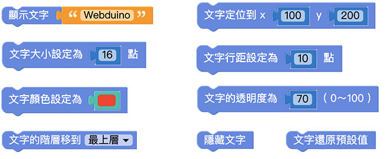

## 显示文字在小怪兽互动舞台中{{text-object01}}

「显示文字」积木可以配合文字积木，直接将输入好的文字显示在小怪兽互动舞台中。

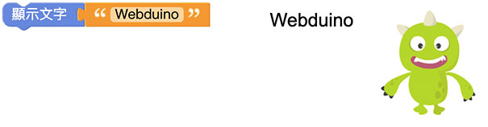
 
## 文字定位{{text-object02}}

「文字定位」积木是以小怪兽互动舞台的左下角为原点 (0,0)，透过设定 x、y 的数值，将文字显示在 xy 座标中的位置。

设定 x 为 100、y 为 200，按下执行，可以看到 Webduino 文字在原点 ( 小怪兽舞台左下角 ) 往右 100、往上 200 的位置。

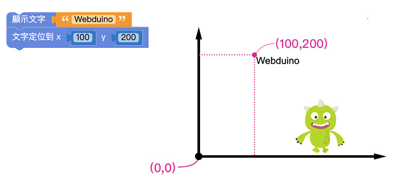

> - 若不使用「文字定位」积木，文字会预设位置在小怪兽互动舞台的*左上角*。
>
> - 因为位置的判定是以*文字的左上角* 为准，因此当「文字定位」积木设定成 *x 为 0、y 为 0* 时，文字的左上角刚好位在小怪兽舞台的左下角 ( 座标的原点 )，所以画面中是看不到文字的。

## 文字大小{{text-object03}}

「文字大小」积木可以改变文字的字体大小，预设为 16 点。

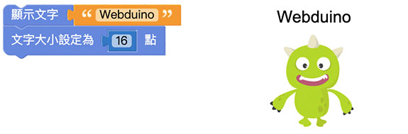

将文字大小改为 50 点，按下执行，可以看到 Webduino 文字变大。

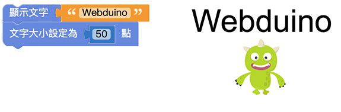

## 文字行距{{text-object04}}

「文字行距」积木可以改变文字的行距，在不使用「文字行距」积木的情况下，预设的行距为 normal。

这里为了展示行距的效果，需要使用「建立字串」积木。
在 2 个文字积木之间放入「换行」积木。放入「文字行距」积木设定为 50 点，按下执行，就可以看到 2 段文字之间的距离增加了。

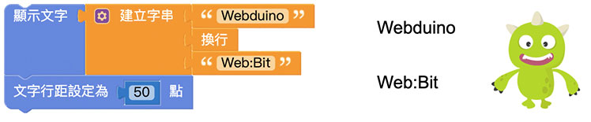

> 行距 normal 会随着文字大小而改变。
在不改变文字大小的情况下，文字的行距预设为 18 点。

## 文字颜色{{text-object05}}

「文字颜色」积木可以改变文字的颜色，搭配前面介绍的「颜色」积木能够做出更多的文字颜色变化。

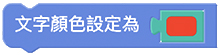

放入「文字颜色」积木，选择颜色，按下执行后可以看到 Webduino 的文字颜色变成红色。

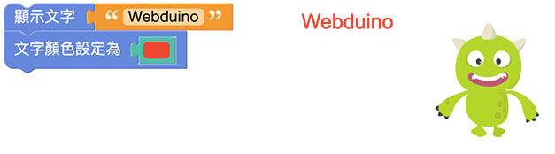

## 文字透明度{{text-object06}}

「文字透明度」积木可以改变文字的透明度，数值可以是 0 ~ 100，0 为完全透明、100 为原始颜色 ( 透明度不变 )。

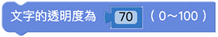

这里尝试将「文字透明度」积木搭配「怪兽控制」积木，让滑鼠触碰到绿色小怪兽的时候能够改变文字的透明度。
设定滑鼠触碰时，文字透明度为 30；滑鼠离开时，文字透明度为 100。按下执行，可以看到文字透明度会随着滑鼠触碰小怪兽而变化。

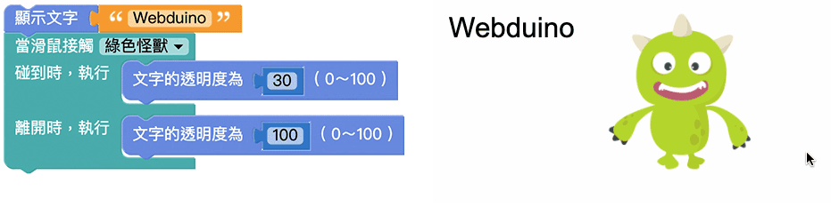

## 文字阶层{{text-object07}}

「文字阶层」积木能够控制文字的上下顺序位置，决定文字是否会被小怪兽遮蔽。

在预设情况下执行，文字会被小怪兽覆盖。
若放入「文字阶层」积木并设定*移到最上层*，执行后可以看到文字显示在小怪兽的上方。

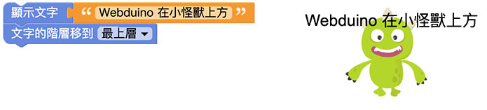

## 隐藏文字{{text-object08}}

「隐藏文字」积木和设定为全透明不同，是直接将设定的文字取消显示。

先使用「显示文字」积木设定文字，在后方加上「隐藏文字」积木，按下执行，可以看到原本预设的文字直接被隐藏。

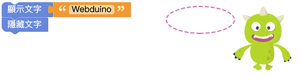

## 文字还原预设值{{text-object09}}

「文字还原预设值」积木可以把前面的程式积木对文字做的任何变化都还原成预设值。

> 文字预设值：
> - 位置：小怪兽舞台左上角
> - 大小：16
> - 行距：normal
> - 颜色：黑色
> - 透明度：100
> - 阶层：预设 ( 小怪兽下方 )
> - 隐藏：正常显示

先对文字做不同的变化设定，让文字产生不同的样式变化。

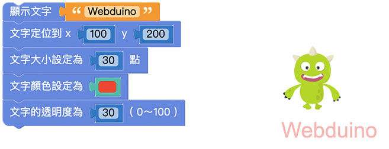

在下方加入「文字还原预设值」积木，按下执行，可以看到刚刚做的变化设定都还原成未做任何变化的文字。

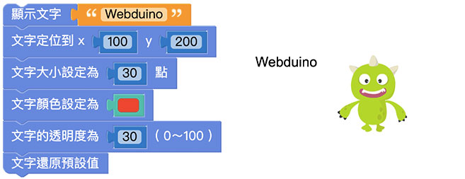

若是在「文字还原预设值」积木下方再加入其它积木，执行后就会再次改变文字样式。

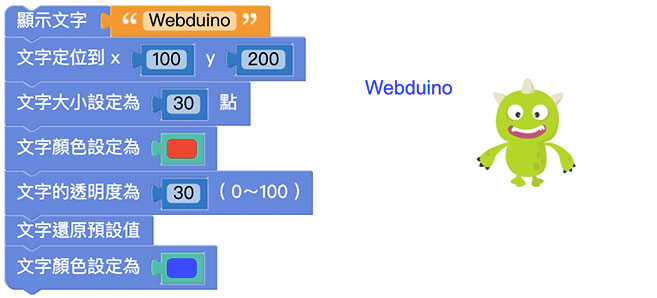
