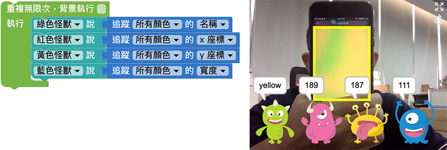
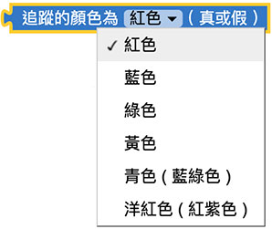
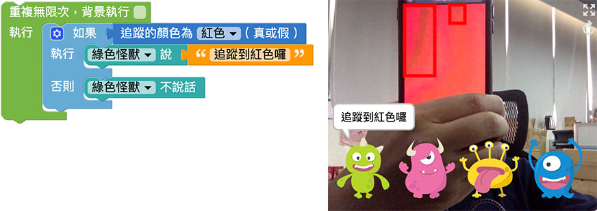
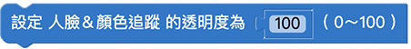
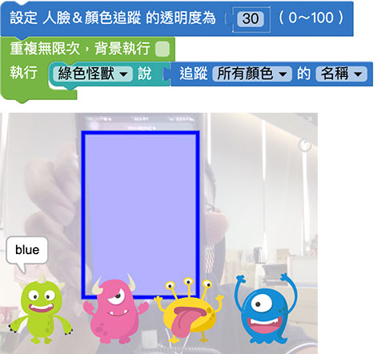
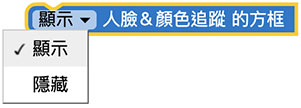

# Web:Bit 人脸＆颜色追踪

透过 Web:Bit 教育版，启动电脑摄影机的影像撷取和内建的影像追踪技术，追踪「人脸」和「颜色」，借由追踪所得到的数值、状态或座标，实现许多好玩又有创意的应用。

## 人脸＆颜色追踪 积木清单

人脸＆颜色追踪的积木包含追踪人脸的座标、追踪颜色的座标、追踪颜色结果的布林值、影像透明度和追踪方框是否显示。

## 追踪人脸的座标{{tracking01}}

「追踪人脸的座标」积木除了可以追踪到人脸的 x 和 y 座标，也可以追踪人脸的宽度和高度，以及画面中出现几张人脸。( 注意，追踪人脸并非辨识人脸 )

追踪人脸的座标积木必须搭配「重复回圈」使用，将积木放在重复无限次的回圈里，让小怪兽讲出追踪到人脸的座标和宽度，程式执行后，摄影机就会开始追踪人脸。

> 注意，程式执行时会需要启用摄影机的操作权限。

## 追踪颜色的座标{{tracking02}}

「追踪颜色的座标」积木可以指定追踪六种颜色 ( 红、蓝、绿、黄、青、洋红 )，以及追踪这些颜色的座标、宽高和名称。

> 注意，由于摄影机成像和光线的缘故，请在白光下进行测试会较为准确 ( 例如偏红色光下的蓝色物体，透过摄影机解析后可能不会是蓝色 )

追踪颜色的座标积木必须搭配「重复回圈」使用，将积木放在重复无限次的回圈里，让小怪兽讲出追踪到颜色名称和座标、宽度，程式执行后，摄影机就会开始追踪颜色。

> 注意，程式执行时会需要启用摄影机的操作权限。

## 追踪的颜色结果{{tracking03}}

「追踪的颜色结果」积木使用后，会告诉我们现在画面上「有没有」追踪到某个特定颜色，若是有追踪到会回传 true 真，否则回传 false 假。

追踪的颜色结果的座标积木必须搭配「重复回圈」使用，将积木放在重复无限次的回圈里，接着放入「逻辑」的积木，设定如果侦测到红色，就让小怪兽讲话，否则就不讲话。

> 注意，程式执行时会需要启用摄影机的操作权限。

## 设定人脸＆颜色追踪的透明度{{tracking04}}

「设定人脸＆颜色追踪的透明度」积木可以设定画面中影片的透明度，0 表示全透明，100 表示不透明。

下图的例子，将摄影机画面的透明度设定为 30，就会看见半透明的背景。

## 显示/隐藏人脸＆颜色追踪方框{{tracking05}}

「显示/隐藏人脸＆颜色追踪方框」积木可以设定画面中追踪到人脸或颜色时，是否要显示追踪方框。

