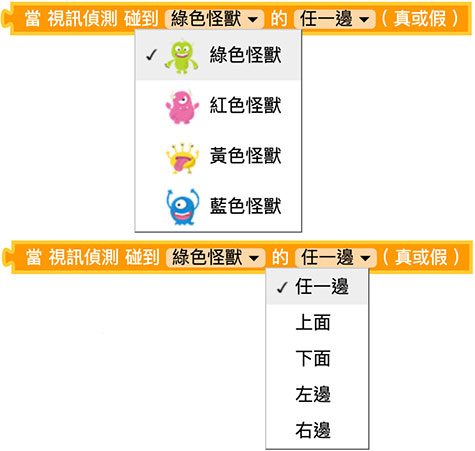
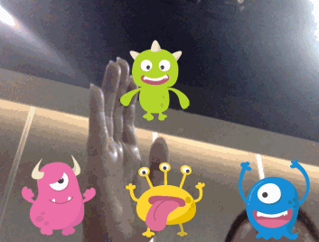

# Web:Bit 视讯侦测

Web:Bit 视讯侦测功能可以透过摄影机，侦测画面的变化，透过变化的位置进一步和小怪兽互动，轻松实现许多和影像有关的虚实整合应用。

## 视讯侦测 积木清单

视讯侦测积木包含一个视讯侦测碰触的积木，以及摄影机影像透明度的积木。

## 当视讯侦测碰到小怪兽{{vd01}}

「当视讯侦测碰到小怪兽」积木可以侦测是否碰到指定的小怪兽，以及判断碰到四个边缘的哪一边。

当视讯侦测碰到小怪兽的积木必须搭配「重复回圈」，下图的例子，将「逻辑」积木放入重复回圈里，判断触碰到小怪兽左方就往右移，碰到小怪兽右方就往左移，程式执行后，就可以用手在摄影机前触碰小怪兽让小怪兽移动。

> - 注意，程式执行时会需要启用摄影机的操作权限。
>
> - 范例连结：[触碰小怪兽改变小怪兽位置](https://webbit.webduino.io/blockly/?demo=default#6RLQJ42QOWzqV#_blank)

## 设定视讯侦测透明度{{vd02}}

「设定视讯侦测透明度」积木可以设定画面中影片的透明度，0 表示全透明，100 表示不透明。

