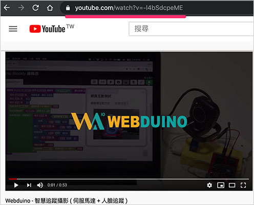
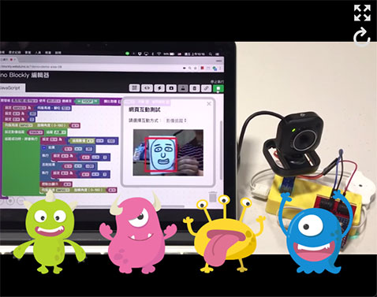
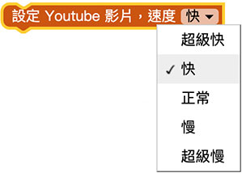
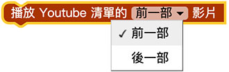
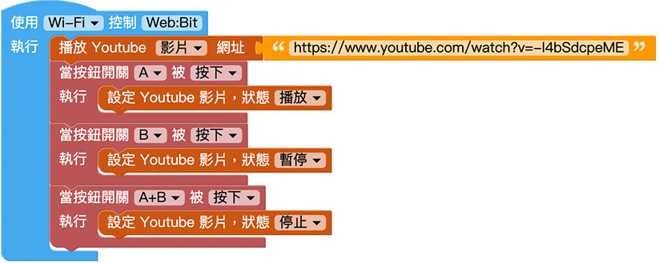

# Web:Bit + Youtube

透过 Web:Bit 教育版，能将物联网开发板与传感器结合 Youtube，告别大多数人对于 Youtube 线上浏览影片的刻板印象，创造新型的互动模式和物联网影音效果。

# Youtube 积木清单

Youtube 的积木包含载入 Youtube、播放控制、速度控制、音量控制、影片清单...等 Youtube 大部分功能。

## 播放 Youtube 影片{{youtube01}}

「播放 Youtube 影片」积木可以将 Youtube 的影片或影片清单，载入至怪兽舞台区播放。

前往 Youtube 网站，寻找一支自己喜欢的影片，复制影片的网址。

也可以点选 Youtube 的分享复制网址。

注意，如果网址后方有 list，表示「影片清单」。

复制网址后，回到 Web:Bit 编辑画面，在画面中放入「播放 Youtube 影片」的积木，在后方贴上刚刚复制的 Youtube 网址。

程式执行后，小怪兽互动舞台就会开始播放 Youtube 影片。

## 设定 Youtube 状态{{youtube02}}

「设定 Youtube 状态」积木可以指定 Youtube 进行播放、暂停或停止。

## 设定 Youtube 音量{{youtube03}}

「设定 Youtube 音量」积木可以设定 Youtube 的播放音量为大、中、小和无声。

## 设定 Youtube 速度{{youtube04}}

「设定 Youtube 速度」积木可以设定 Youtube 的播放速度为超级快 ( x2 )、快 ( x1.5 )、正常、慢 ( x0.5 ) 和超级慢 ( x0.25 )。

## 隐藏或显示 Youtube{{youtube05}}

「隐藏或显示 Youtube」积木可以设定画面中是否要出现 Youtube 影片，若选择隐藏，Youtube 还是会播放，也可以控制 Youtube，只是在画面中看不到。

## 设定 Youtube 前往秒数{{youtube06}}

「设定 Youtube 前往秒数」积木可以指定 Youtube 跳转到某个秒数，如果大于一分钟，则要将分钟成以六十做秒数换算。

## 取得 Youtube 播放状态{{youtube07}}

载入 Youtube 之后，可以透过「取得 Youtube 播放状态」积木，取得目前 Youtube 播放状态的「布林值」( true 或 false )，进一步搭配逻辑判断做更多变化。

## 取得 Youtube 正在播放的秒数{{youtube08}}

载入 Youtube 之后，可以透过「取得 Youtube 正在播放的秒数」积木，取得目前 Youtube 播放的秒数。

## 设定 Youtube 播放清单{{youtube09}}

「设定 Youtube 播放清单」积木，可以指定 Youtube 播放清单中的前一部影片或后一部影片。

## 设定 Youtube 播放清单第几部影片{{youtube10}}

「设定 Youtube 播放清单第几部影片」积木，可以指定 Youtube 播放清单中的第几部影片。

## 透过 Web:Bit 控制 Youtube 影片{{youtube11}}

透过 Youtube 相关积木，能将 Web:Bit 开发板设计成 Youtube 的遥控器，首先放入 Web:Bit 开发板积木，接着放入「播放 Youtube 影片」积木，输入欲播放的影片网址，接着放入按钮开关的积木，按下 A 时播放影片，按下 B 则暂停影片，A 和 B 同时按下就停止影片，程式执行后，就可以透过 Web:Bit 开发板操控 Youtube 的播放。

