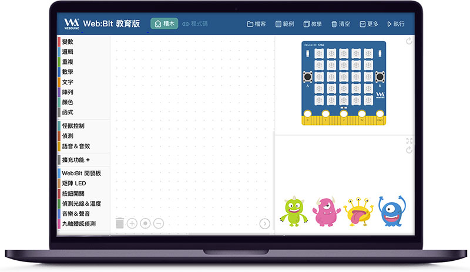
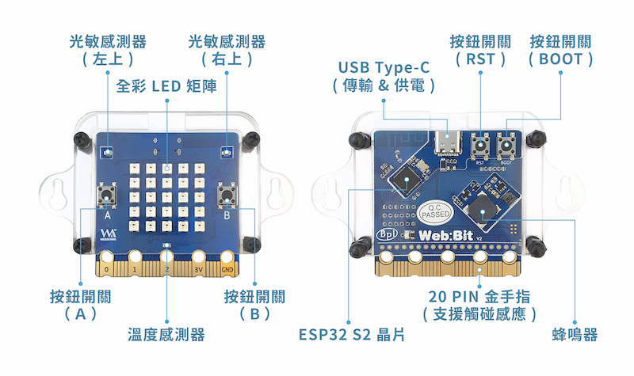
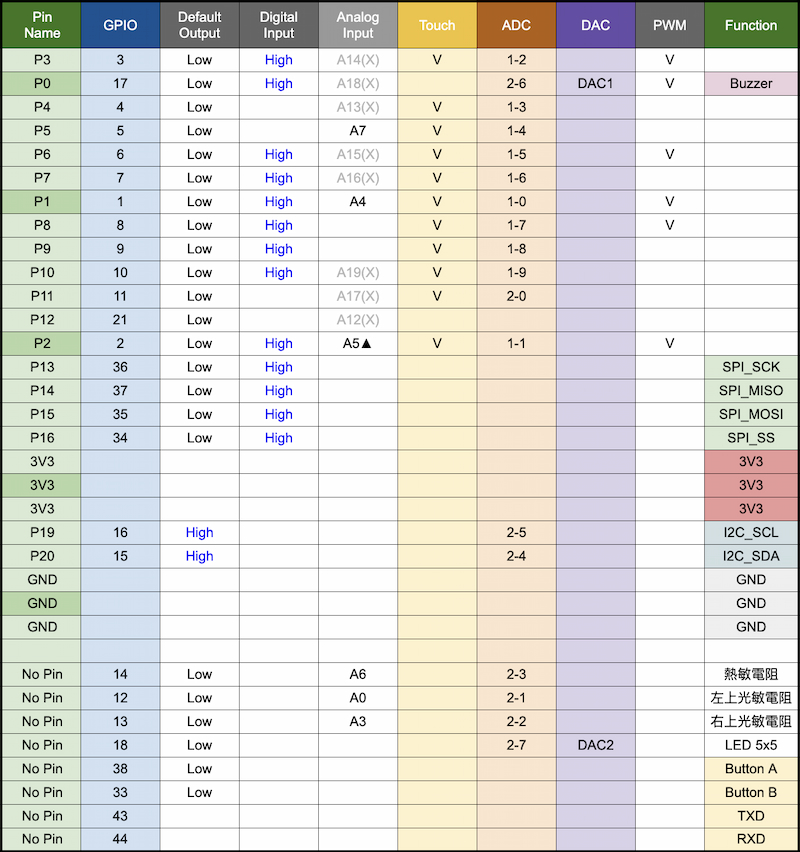
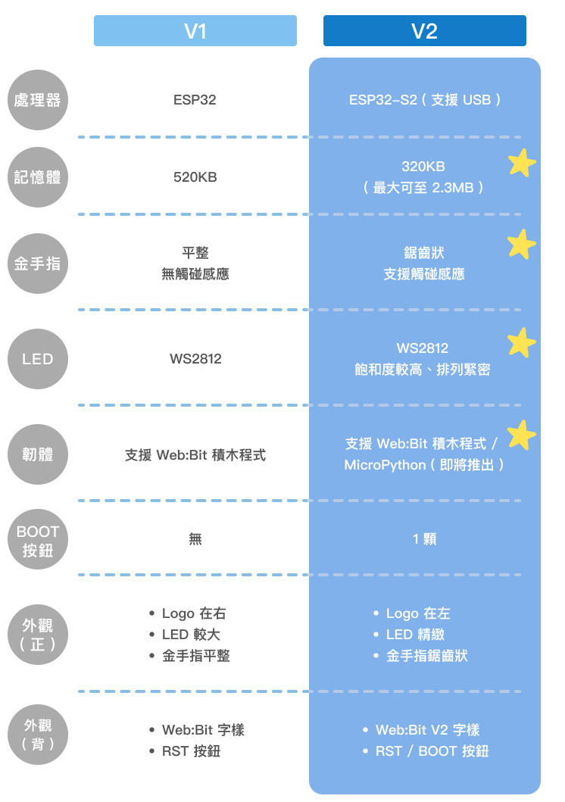

# Web:Bit 教育版

因应落实运算思维与资讯科技教育，Webduino 于 2019 年推出了 Web:Bit 教育版，Web:Bit 教育版是基于 Webduino Bit 所延伸的教学版本，主要分成「编辑器」和「开发板」两个部分，藉由软硬体的整合，可以学习程式设计、数学逻辑和网路知识，也能充分感受物联网的趣味和便利，并从中获得创造性思考、编程与合作分工的体验。

> - Web:Bit 教育版编辑器*目前所有功能全部免费*，如果需要搭配硬体实作更多创意，则需*额外购买 Web:Bit 硬体开发板*，就能进行软硬整合的搭配应用。
>
> - 购买 Web:Bit：[Webduino 线上商店](https://store.webduino.io/products/webduino-bit#_blank)

## Web:Bit 编辑器{{software}}

Web:Bit 教育版的编辑器分成网页版和安装版两种，两个版本介面与功能几乎完全相同，可以依据不同的需求采用不同的版本，相关功能请继续参考 [编辑器 ( 安装版工具列 ) ](info/toolbar.html) 和 [编辑器 ( 操作介面 )](info/interface.html) 两篇教学。

### 1、网页版

网页版不需要安装任何软体，只要电脑有网路，透过浏览器打开指定网页就能运作，不论是 Windows 或 Mac 都能运作，适合快速体验的使用者。 ( 网页版限定 Google Chrome 浏览器 )  

网页版即日起可透过 USB 控制开发板啰！使用前，请先更新开发板韧体，详细操作方式请参考教学文 [Web:Bit 开发板](https://webbit.webduino.io/tutorials/doc/zh-tw/education/board/board.html)。

> 网页版网址：[https://webbit.webduino.io](https://webbit.webduino.io#_blank)

### 2、安装版

安装版目前只提供 Windows 版本，介面和操作方式和网页版完全相同，差别在于安装版需要下载 Web:Bit 的执行档进行安装，虽然多了额外的安装步骤，但安装版能够更方便的进行「*初始化设定*」、「*USB 连线*」...等操控行为。

> - 参考资源：[编辑器 ( 安装版工具列 ) ](info/toolbar.html)
> - 安装版下载：[WebBitSetup.exe](https://ota.webduino.io/WebBitInstaller/WebBitSetup.exe#_blank)

## Web:Bit V2 开发板

Web:Bit 是 Webduino 最新的开发板，除了原本的功能一应俱全 ( Wi-Fi 操控、多装置串连、协同作业...等 )，更内建许多新的元件和传感器、搭配内建 2.4G Wi-Fi 功能，是目前市面上最高效能、最稳定以及最通用的产品之一。

> - 如欲操控 Web:Bit 开发板，请先阅读 [硬体 ( 初始化与更新 )](info/setup.html) 一文，进行相关网路设定。
>
> - 购买 Web:Bit 请至 [Webduino 线上商店](https://store.webduino.io/products/webduino-bit#_blank)

### 硬体规格

Web:Bit v2 开发板长 5 公分宽 5 公分，重量约 10~12 公克，除了下方 20 Pin 的「金手指介面」，更内建一个 25 颗全彩 LED 灯的矩阵，两个光敏电阻、两个按钮开关、一个温度感应电阻，以及一个蜂鸣器。

- 全彩 LED 矩阵：( GPIO 18 )
- 光敏感应器：左上 ( GPIO 12 )、右上 ( GPIO 13 )
- 按钮开关：按钮 A P5 ( GPIO 5 )、按钮 B P11 ( GPIO 11 )
- 温度感应器：( GPIO 14 )
- 蜂鸣器：P0 ( GPIO 17 )

### Web:Bit V2 脚位列表

## Web:Bit V1 开发板

### 硬体规格

Web:Bit 开发板长 5 公分宽 5 公分，重量约 10~12 公克，除了下方 20 Pin 的「金手指介面」，更内建一个 25 颗全彩 LED 灯的矩阵，两个光敏电阻、两个按钮开关、一个温度感应电阻 一个蜂鸣器和一个九轴感测器 ( 三轴加速度、三轴陀螺仪与三轴磁力指南针 )。

- 全彩 LED 矩阵：A10 ( GPIO 4 )
- 光敏感应器：左上 A0 ( GPIO 36 )、右上 A3 ( GPIO 39 )
- 按钮开关：按钮 A P5 ( GPIO 35 )、按钮 B P11 ( GPIO 27 )
- 温度感应器：A6 ( GPIO 34 )
- 蜂鸣器：P0 ( GPIO 25 )
- 九轴感测器 MPU-9250：P20 ( GPIO 21 )、P19 ( GPIO 22 )

### 脚位列表

## V1 与 V2 比较

