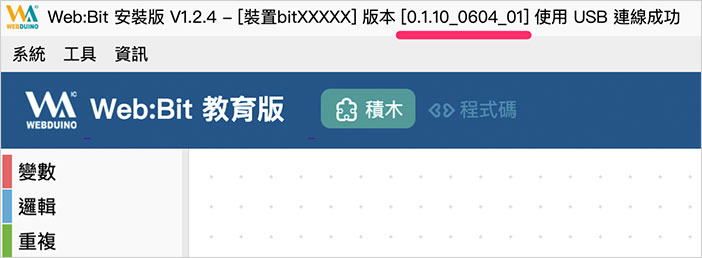
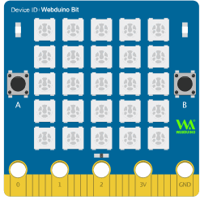

# Web:Bit 硬体开发板 ( 更新韧体 )

如果已经完成了Web:Bit 开发板的初始化设定且也顺利连接上所在场所的Wi-Fi，接着就可以准备更新Web:Bit 开发板的韧体程式了，又或者如果是使用编辑器安装版，可以再不用初始化的状态下，直接透过安装版完成韧体更新。

## 更新韧体方法 1：使用安装版进行更新{{step1}}

在电脑中打开安装版( 不清楚什么是安装版，请参考[Web:Bit 编辑器](../index.html#software) )，将Web:Bit 开发板使用USB 线连接电脑，确认安装版已经正确读取到Web:Bit 开发板之后( 上方会出现Web:Bit 开发板的Device ID 以及版本号码)，滑鼠选择「*工具> 更新韧体*」，就能开始更新。

> 安装版下载：[WebBitSetup.exe](https://ota.webduino.io/WebBitInstaller/WebBitSetup.exe#_blank)

**如果一直出现「扫描USB 装置」，没有出现连线成功的讯息**，表示Web:Bit 开发板的韧体可能有问题( 程式错误或自行写入其他韧体)，此时可以用滑鼠选择「*工具> 回复原厂韧体*」进行韧体更新。 ( 已经出现连线成功文字讯息可忽略此步骤，*强制更新韧体可能会让 Device ID 不同*，请特别注意！ )

如果系统有侦测到有新版本韧体，也会在连接电脑后弹出视窗提示。

如果没有弹出视窗提示，亦会在上方的讯息文字里，出现提示更新的讯息。

点选更新后，会再度提示请勿关闭程式或移除 USB 线，按下确认后就开始更新。

更新时最上方的讯息文字，会同步显示更新的进度。

更新直到 100% 之后会显示目前的版本号码，表示 Web:Bit 开发板韧体已经更新完成。 ( 下图范例已经从 0.1.07_0105 更新为 0.1.10_0604_01 )

## 更新韧体方法 2：透过 Wi-Fi 远端更新{{step2}}

远端更新 ( OTA ) 可以在 Web:Bit 开发板连上网路后，连线远端伺服器更新取得最新版本韧体，更新步骤如下：

- 步骤 1、确认开发板已经可以正常连上 WiFi，若不行，请检查 WiFi 连线或重新进行初始化设定。
- 步骤 2、移除开发板电源。
- 步骤3、接上开发板电源，**在白色跑马灯灯显示文字的时候，按住按钮A，持续按住按钮A，直到开发板闪完红灯、绿灯熄灭上线后，此时会再听到蜂鸣器发出轻微的一个声响，再放开按钮A**。

  

- 步骤 4、完成后会看到开发板的点矩阵，由第一颗灯开始亮蓝灯，表示开始进行更新，*当蓝灯全部亮起接着熄灭后，表示更新完成*。

  

- 步骤6、更新完成后开发板会闪红灯自动进行连线，连线成功会亮绿灯后绿灯熄灭，表示远端更新完成，此时也可以透过WiFi 连线开发板，由192.168.4.1 进入设定画面，在设定画面最下方会看到开发板的版本号变成新的版本。

## 还原初始设定值

如果我们想要还原硬体出厂时的设定值，可以透过类似 Wi-Fi 远端更新的方式来实现，步骤如下：

- 步骤 1、移除开发板电源。
- 步骤 2、**同时按住按钮 A 和 B。 **
- 步骤 3、接上开发板电源，**听到蜂鸣器发出声响后放开按钮 A 与 B**，此时开发板已经恢复出厂设定值。 ( **恢复设定值会将自订的 Wi-Fi 帐号、密码、自订的 device SSID 和密码清除，这个步骤会造成开发板无法连接所在场所的 Wi-Fi** )
- 步骤 4、重新执行初始化设定，参考：[Web:Bit 硬体 ( 初始化设定 )](setup.html)