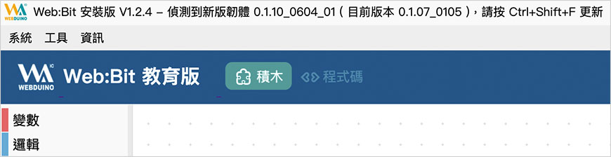
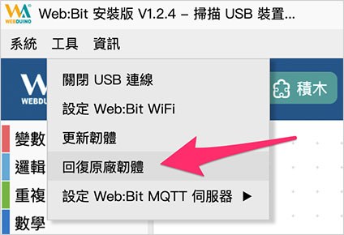

# Web:Bit 编辑器 ( 安装版工具列 )

Web:Bit 编辑器的安装版是特别为了没有Wi-Fi 的环境所打造，只要将编辑器打开，将Web:Bit 开发板连接USB 线就可以进行操控、更新或相关设定，这篇教学会介绍安装版的工具列功能。 ( 以下将编辑器安装版统称为安装版 )

> 安装版下载：[WebBitSetup.exe](https://ota.webduino.io/WebBitInstaller/WebBitSetup.exe#_blank)

## 功能说明

安装版的工具列里分别有「*系统*」、「*工具*」和「*资讯*」三个主要功能列表。

### 系统 > 以浏览器开启

点选「以浏览器开启」，会自动开启电脑的Chrome 浏览器并连结至[Web:Bit 编辑器( 网页版)](https://webbit.webduino.io#_blank)，通常这个功能不太常用到，但如果使用安装版不支援的功能( 像是「语音朗读」在安装版仅能发出英文语音)，可以透过网页版来实现。

### 工具 > 关闭 USB 连线

如果Web:Bit 开发板使用USB 线连接到电脑，安装版可以在没有Wi-Fi 的状态下控制开发板，但此时开发板也「没有Wi-Fi 连线功能」，如果要开启开发板的Wi-Fi 连线功能，则需关闭安装版程式，或是点击「关闭USB 连线」功能。

> 注意，*如果关闭 USB 连线，开发板就会采用 Wi-Fi 连线模式，反之开启 USB 连线，开发板就会关闭 Wi-Fi 连线功能*。

在操作上也可以透过下拉选单区隔 Wi-Fi 操控或 USB 连线操控。 ( 详细操作方式会在后面的篇幅介绍 )

### 工具 > 设定 Web:Bit WiFi

点击该选项之后，会要求我们输入Wi-Fi 的SSID 和密码，这功能可以帮助我们将「欲连线的基地台」的Wi-Fi SSID 和密码设定到Web:Bit 开发板中，不过如果没有Wi-Fi 操控的需求，是不会用到该功能的。 ( 详细设定可以参考 [初始化方法 1：使用安装版进行初始化](setup.html#step1) )

### 工具 > 更新韧体

如果 Web:Bit 开发板有新版本的韧体，可以点击该选项进行韧体更新。 ( 详细设定可以参考 [更新韧体方法 1：使用安装版进行更新](setup.html#step1) )

### 工具 > 强制更新韧体

如果 Web:Bit 开发板的韧体有问题而无法读取 ( 程式错误或自行写入其他韧体 )，可以用滑鼠选择「*工具 > 回复原厂韧体*」进行韧体更新。 ( *强制更新韧体可能会让 Device ID 不同*，请特别注意！ )

### 工具 > 设定 MQTT 伺服器

因应中国伺服器架构不同，如果是简体中文版本，请将 MQTT 伺服器设定为「中国」，繁体中文和英文版本预设为「全球」。

### 资讯 > 版本、复制装置 ID、快捷键说明

版本功能会显示目前 Web:Bit 的韧体版本，复制装置 ID 可以将 Web:Bit 开发板的 Device ID 复制到剪贴簿，而快捷键会显示安装版支援的各种快捷键。

