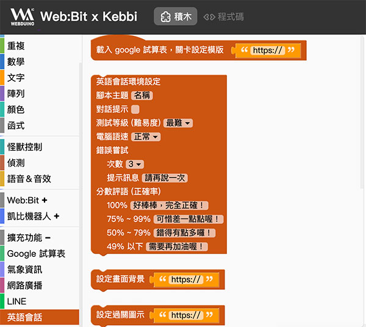

# 英语会话 ( 使用 Google 试算表 )

在 Webduino 凯比物联网教室的扩充功能里，可以自己设计英语会话的游戏与应用情境，部署到凯比机器人之后，产生与众不同的互动效果，这篇文章将会介绍透过 Google 试算表的方法设定英语会话。

## 使用英语会话 Google 试算表积木

使用电脑的 Chrome 浏览器开启凯比物联网教室，输入凯比机器人的 ID 以及密码登入。

> - 凯比物联网教室：[https://kebbi.webduino.io](https://kebbi.webduino.io#_blank)
>
> - 延伸阅读：[凯比物联网教室系列教学](../index.html)

登入后，进入 Web:Bit 程式积木。

点选右上方「扩充」选单，开启扩充功能，画面往下拉，点选「英语会话」，就可以将英语会话的扩充积木加入积木清单。

关闭扩充功能，回到编辑画面，在左侧积木清单的扩充功能里，可以看到「英语会话」的积木选项，里头的积木除了第一块「载入 Google 试算表关卡模板」是独立运作，其他的积木则必须交互配合使用，就能做出互动式的英语会话情境。

将「载入 Google 试算表关卡模板」放入编辑画面中，这块积木将会载入英语会话的 Google 试算表模板，透过试算表的设定，就能自动产生对应的互动关卡。

## 载入模板

在 Chrome 浏览器中开新分页，使用自己的 Google 帐号登入 Google 云端硬碟，登入后，打开英语会话  Google 试算表模板。

> 点选开启：[英语会话 Google 次算表模板](https://bit.ly/kebbi-english)

点选左上方「档案」，选择「建立副本」，将试算表模板建立一个副本到自己的云端硬碟里，这时浏览器也会自动开启这个副本。

## Google 试算表权限设定

接着编辑模版副本的权限，点选右上方的「共用」，修改试算表的权限为「知道连结的人使用者」都是「检视者」，按下完成储存设定。

## 英语会话模板设定

英语会话的试算表模板，第一个 setting 工作表表示「*英语会话关卡设定*」，包含了标题、提示、随机、错误尝试、分数、等级、语速和过关图片。( *有红色星号的栏位代表「可以修改」*的设定 )

第二个 script 工作表表示「*英语会话的对话内容*」，每一组对话有一个深灰色的的「*标题*」，执行后不会显示在画面中，目的只是作为区隔不同组别的对话使用，。( *有红色星号的栏位代表「可以修改」*的设定 )

每一组对话也分别包含了「*背景图片、四种角色的设定和对话内容*」，背景图片目前只支援网路图片，只要有图片的网址，将网址复制贴上在这个栏位内，执行后就会显示在画面中，四种角色的设定分别可以设定角色是「*computer 电脑、user 使用者或是不显示*」，设定为 computer 就会由电脑自动发音，设定为 user 使用者就由使用者进行朗读做语音识别判读，设定无，则不会显示，而角色图片也是使用网路图片，只要有角色图片网址，执行后就会在画面中显示该角色。( *有红色星号的栏位代表「可以修改」*的设定 )

角色对话可以透过角色的编号，来指定哪个角色要讲话或进行朗读测验。( *有红色星号的栏位代表「可以修改」*的设定 )

如果要设定两组以上的对话，只要复制上一组的对话内容，贴到最下方即可。

## 执行英语会话

英语会话模板设计完成后，复制这份试算表的网址，接着回到 Webduino 物联网教室的 Web:Bit 程式积木，放入「载入 Google 试算表关卡模板」积木，在模板的网址区域贴上试算表的网址。

按下右上方的「执行」按钮，就会看见右下角的「怪兽舞台区域」，变成英语会话的关卡，点击右上角全萤幕的符号，变成全萤幕就可进行会话互动。

如果要将英语会话关卡部署到凯比机器人，将滑鼠移到右上方的「更多」选单，点选「部署到机器人」，输入这个程式的专案名称，以及登入时的密码，就能将英语会话的程式部署到凯比机器人。

