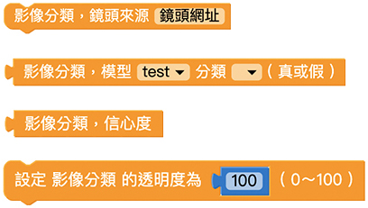
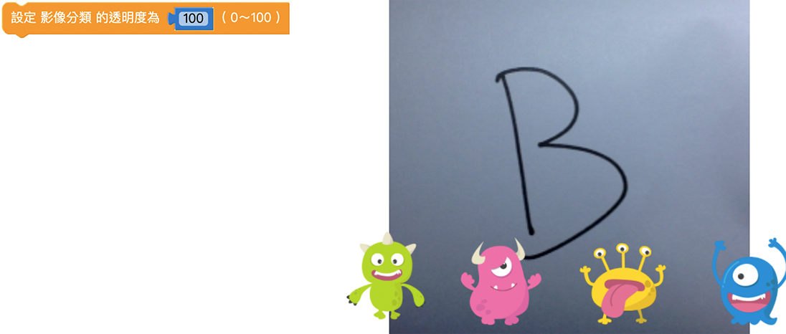
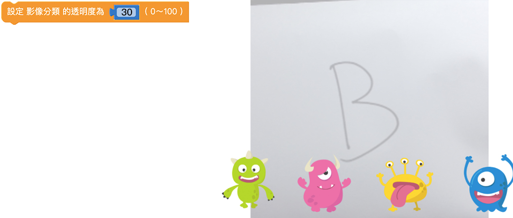
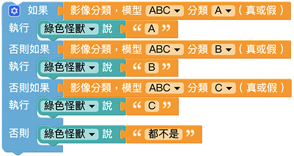
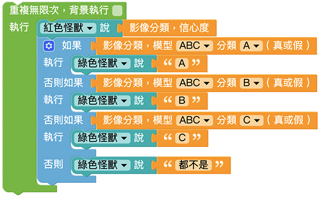
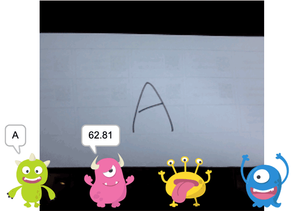

# 影像分类

扩充功能中的影像分类功能可以使用程式积木，配合影像训练过的模型来辨识侦测到的物体，达到影像辨识的效果。  
教学中会先列出影像分类的各积木功能，再来介绍影像分类的程式操作步骤，因为会需要使用到[影像训练](training.html) 的分类模型，所以执行程式积木前需要先建立分类模型。

## 影像分类积木清单

影像分类积木包含镜头来源、模型分类、信心度、透明度等积木。

## 镜头来源

「镜头来源」积木可以选择使用镜头讯号的来源，在积木内填入使用的镜头网址，就能够控制视讯画面的来源。

若是使用装置上的镜头则不需要使用「镜头来源」积木。

## 模型分类

「模型分类」积木表示辨识到的影像是某模型中的某分类。
将影像训练建立的模型和分类名称设定到积木中，让程式判断是否辨识为真，搭配其它积木能够再执行后续动作。  
积木中的模型分类会对应到 [影像训练](training.html) 中的模型和分类，在使用「模型分类」积木前，需要先将影像训练中的模型分类建立完成。这里的例子是使用「模型 ABC」及其分类。

## 信心度

「信心度」积木能够读取出影像辨识的信心度数值， 数值单位为 ％。信心度最高为 100、最低为 0，若信心度越高，代表侦测错误的可能性越低。

> 因为影像训练辨识的结果会落在一个区间范围内，若信心度为 90%，代表有 90% 的机率真正的结果会落在这个区间范围内。

## 透明度

「透明度」积木可以改变影像的透明度，数值可以是 0 ~ 100，0 为完全透明、100 为原始颜色 ( 透明度不变 )。

## 影像分类操作

这里开始进行影像分类的程式教学。

为了要在辨识的时候显示信心度，使用「小怪兽讲话」积木加上「信心度」积木，让其中一只小怪兽说出信心度的数值。

再来要撰写影像分类的逻辑程式，这里的例子中会有 4 种辨识结果，包含「A」、「B」、「C」 和「都不是」。  

使用「如果执行」积木，后方加入「模型分类」积木，让影像分类成功时进行下一动作。这里的例子是让小怪兽说出辨识结果，因此在「如果」、「否则如果」后方分别设定 3 种辨识结果，并让小怪兽说出。  
因为辨识的物品有可能都不是分类的影像，所以在「否则」后方设定小怪兽说出「都不是」。

完成影像分类的逻辑程式后，就能够正常进行辨识，但是这样的程式只能进行判断一次，所以需要在最外侧增加一个「重复」积木。这里选用「无限重复」积木，可以让程式不断辨识影像，并显示辨识结果。

完成之后按下执行，可以看到随着辨识影像的改变，小怪兽说出的辨识结果和信心度也会随着改变。

