# 影像训练

在影像训练的功能中，我们可以建立出自己的影像分类和影像模型，透过对这些影像的特征分析，可以辨识出镜头捕捉的影像是属于哪项物品。

## 影像训练流程

进入凯比物联网教室后，选择「Webduino 影像训练」，进入影像训练页面。

在页面中可以看到左侧有「分类」和「模型」两个选项，分别为建立图片库和执行影像辨识功能。

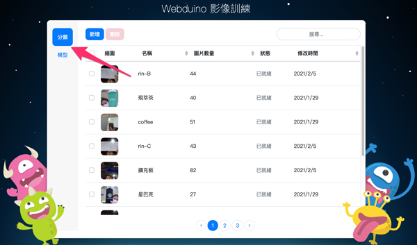

进行影像辨识的流程中，需要先分别建立影像分类和模型，接着将分类放入模型中，就可以使用模型来进行影像辨识了。

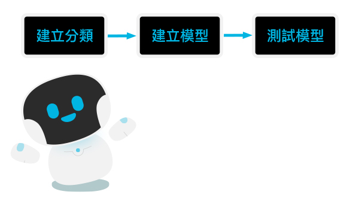

## 建立影像分类

首先在左侧的侧边列选择「分类」。  
画面中的列表是用来存放建立过的分类，可以从名称、图片数量、修改时间的排序和搜寻功能来找到已建立的分类。

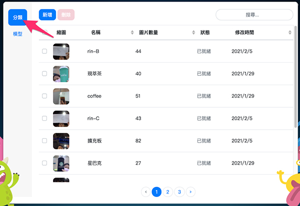

### 建立分类

按下蓝色的「新增」按钮，会跳出「建立分类」的视窗，接着输入分类名称和选择分享状态，「私人分类」代表只有自己的帐号才能使用此分类；「公开分类」代表所有人都可以使用。

再来选择影像上传方式，可以从 4 种不同方式上传影像，分别是：
- 上传影像：从自己的电脑中上传影像，可选择上传影像档或 zip 档。
- 摄影镜头：使用装置的摄影镜头拍摄影像。
- 既有分类：从自己的分类列表中选择多个分类，建立成一个新的分类。
- 公开分类：使用他人建立的公开分类来建立分类。

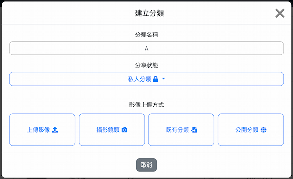

建立完成后，就可以在分类列表中看到刚刚建立的分类了。

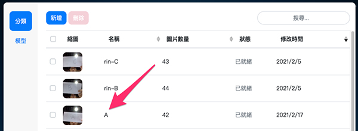

### 使用摄影镜头上传影像

如果选择「摄影镜头」，会进入到撷取影像的页面，这里需要使用装置相机，相机权限选择「允许」。  
等到相机画面出现就可以按下绿色「撷取影像」按钮来拍照，移动物品来让镜头撷取不同角度和位置的影像，能够提高准确度。一般来说，撷取影像的数量越多，影像辨识的准确度会越高。  
撷取完影像后，点击「建立分类」按钮，就可以在分类列表中看到刚刚建立的分类了。

> 按下**红色「清除影像」按钮**后，会将撷取的影像**全部删除**，点击之前请先注意！

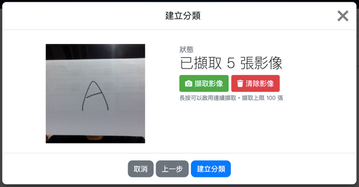

### 修改分类

在分类列表中点选其中一项分类，会跳出「修改分类」的视窗，在这里可以修改分类的名称和分享状态，也可以透过 4 种影像上传方式新增分类中的影像。修改完成后点击「修改并储存」按钮，就可以完成修改。

> 在修改分类功能中，只能增加影像，无法删除分类中的影像。

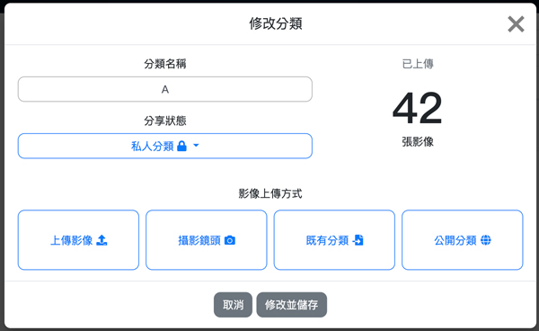

### 删除分类

在分类列表中，可以勾选多个分类后删除。

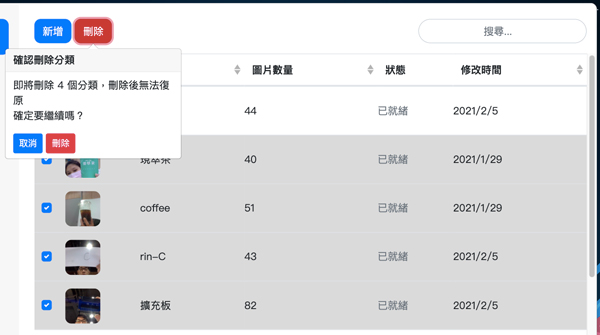

## 建立影像模型

建立完分类后，在左侧的侧边列选择「模型」。
画面中的列表是用来存放建立过的模型，可以从名称、修改时间的排序和搜寻功能来找到已建立的模型。

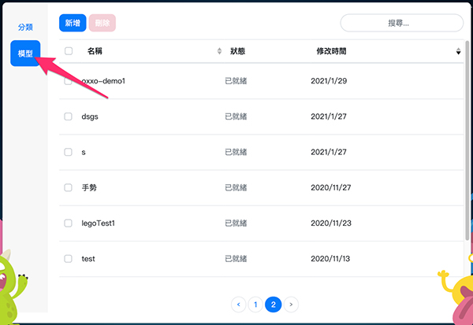

### 新增模型

按下蓝色的「新增」按钮，会跳出「新增模型」的视窗，接着输入模型名称和选择分享状态，「私人模型」代表只有自己的帐号才能使用此模型；「公开模型」代表所有人都可以使用。  

再来选择模型建立方式，可以从 3 种不同方式建立模型，分别是：
- 挑选分类：从分类列表中挑选建立过的分类来建立模型。 *( 分类数量需为 2 个以上 )*
- 复制既有模型：从模型列表中复制曾经建立过模型。
- 复制公开模型：复制他人建立的公开模型。

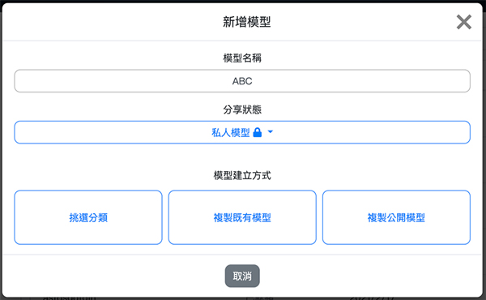

点选「建立模型」后，就可以在模型列表中看到刚刚建立的模型了。

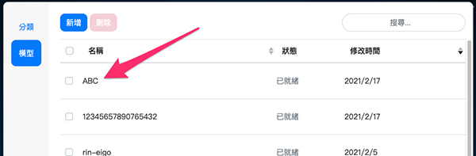

> 若模型训练等待过久，让页面重新整理，就可以看到建立的模型训练完成了。

### 挑选分类

如果使用「挑选分类」来建立模型，需要选择 2 个以上的分类放入模型中，才能辨识出不同的结果。

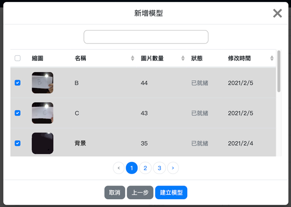

> 建议多放入一个*背景*分类，因为当没有侦测到物件时，辨识结果会显示为其中一项分类。如果有放入*背景*分类，就能正常显示辨识结果为背景。

### 修改模型

在模型列表中点选其中一项模型，会跳出「修改模型」的视窗，选择「修改模型」进入下个页面。  
在这里可以修改模型的名称和分享状态，也可以修改进阶设定中的影像辨识数值。修改完成后点击「修改并储存」按钮，就可以完成修改。

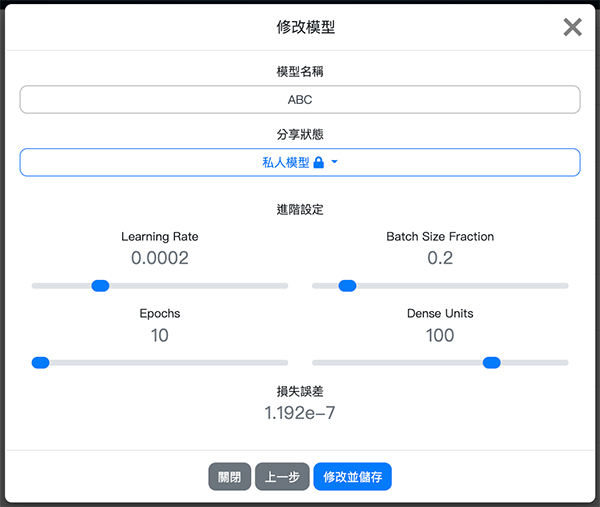

>- 如果点选的是复制的模型，会无法使用「修改模型」功能。
>
>- 调整进阶设定中的影像辨识数值会影响辨识的误差和信心度，一般建议使用预设的数值。

### 删除模型

在模型列表中，可以勾选多个模型后删除。

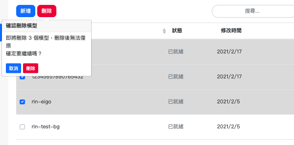

## 测试模型

当模型建立完成后，就可以使用「测试模型」功能来进行影像辨识了。  
从模型列表中点选欲使用的模型，会跳出「修改模型」的视窗，选择「测试模型」进入「测试模型」页面，就可以开始进行影像辨识了。  
开始辨识后，会显示侦测到的辨识结果和信心度，若信心度百分比越高，代表侦测错误的可能性越低。

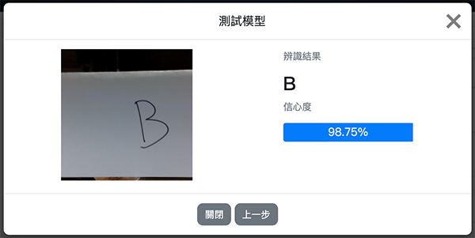

>- 辨识结果会因为场地的光线、背景、装置镜头的角度而影响，因此对同一目标的辨识结果和信心度都会不同。
>
>- 因为影像训练辨识的结果会落在一个区间范围内，若信心度为 90%，代表有 90% 的机率真正的结果会落在这个区间范围内。