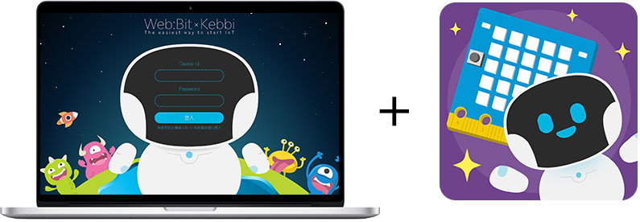

# 凯比物联网教室

Webduino 凯比物联网教室是一个跨领域的物联网平台，整合了 Web:Bit 程式积木和凯比机器人，这系列的文章将会介绍相关的网路与授权设定，以及物联网教室串接凯比机器人的操作流程。

> 凯比物联网教室：[https://kebbi.webduino.io](https://kebbi.webduino.io#_blank)

## 【 重要 】如何登入凯比物联网教室？

如果要使用凯比物联网教室，必须「**透过凯比机器人取得帐号密码**」，详细取得方式请继续阅读相关文章。

> - 如果使用过*没有设定密码*，可*使用凯比机器人的 ID 登入 ( 密码留空 )*，或参考：[设定密码与部署模式](setting/authorize.html#auth05)
>
> - 如果是第一次使用，帐号密码取得方式请参考：[授权启用与设定](setting/authorize.html)

## 其他延伸教学

> - 机器人网路设定：[Wi-Fi 设定](setting/wifi.html)
>
> - 机器人部署设定：[程式部署](setting/deploy.html)

