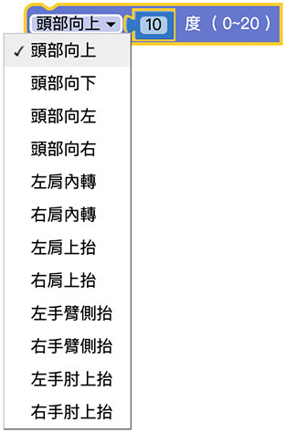

# 肢体

凯比机器人包含脖子、肩膀、手臂、手肘等多个伺服马达关节，透过关节的组合能产生各种不同的肢体动作。

## 肢体积木清单

肢体积木包含一个下拉选单，有头部 ( 上下左右 )、肩膀 ( 内外转 )、肩膀 ( 上下抬 )、手臂和手肘的选项，透过角度栏位设定旋转的角度，后方文字提示角度最大值和最小值的区间。

## 编辑一段自订的肢体动作

所有肢体的旋转，都会同时发生，因此可以透过一连串的组合，实现不同的肢体动作，首先将头部上下移动的积木，放在重复无限次的回圈内，并将重复无限次的回圈勾选「*背景执行*」( 如此才不会影响到后续的程式 )，接着将手臂侧抬的积木放在另外一个重复无限次的回圈里，同样也勾选「*背景执行*」。

部署到机器人开始执行后，就会看见机器人不断地点头以及挥手。

如果顺利部署但是机器人不会动，可以检查机器人的设定是否将动作关闭了。( 手指在凯比脸上从上往下滑动展开选单 )

