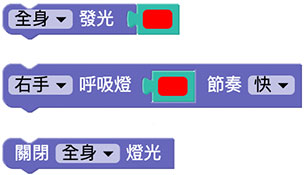
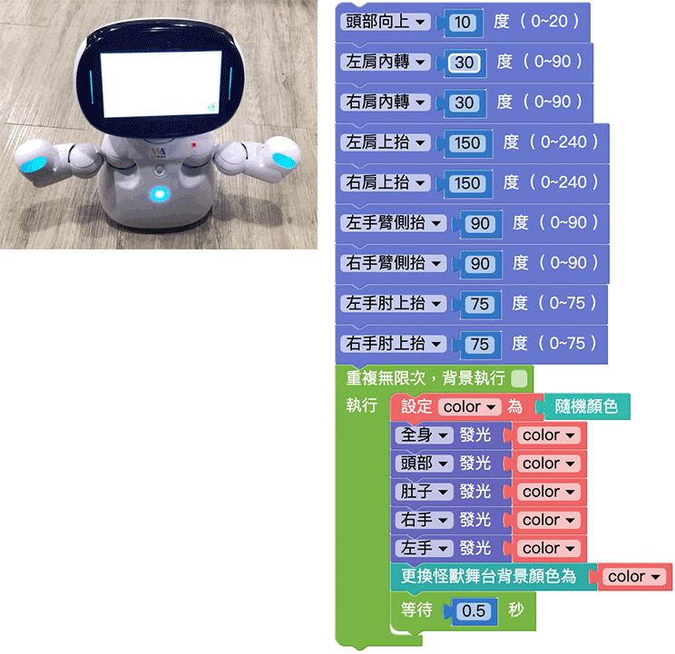

# 灯光

凯比机器人的脸、双手以及肚子上都有可以展示七彩光线的 LED 灯，透过积木程式的操控，就能产生五颜六色的变化。

## 灯光积木清单

灯光积木共有三种，一种是单纯指定亮灯颜色，一种是双手的呼吸灯 ( 渐强渐弱交替 )，一种是关灯。

## 机器人展示同一种颜色

如果要让机器人展示同一种颜色，可以使用「变数」的积木承接某一种颜色 ( 这样做可以不需要不断的做颜色设定 )，再把变数套用到头、肚子、双手的灯光积木里，最后再放入怪兽舞台画面的颜色，部署到机器人执行之后，就会看见机器人呈现随机颜色。

## 机器人七彩颜色闪烁

一开始先设定机器人的动作，接着延伸上方的颜色范例，将积木放到「重复无限次」的回圈里，加上等待一秒的积木，部署到机器人执行之后，就会看见机器人每隔 0.5 秒呈现不同的随机颜色。

