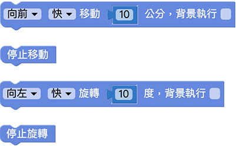
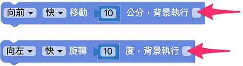

# 移动

透过移动相关的积木，能够让凯比机器人前进后退或左转右转，进一步也可透过网路广播，让小怪兽、键盘或手机都能遥控机器人。

## 移动积木清单

移动积木包含移动、旋转、停止移动和停止旋转四种。

## 背景执行

移动和旋转的积木，除了可以设定方向、速度、距离或角度，后方有一个「背景执行」的选项，若勾选背景执行，则该积木会独立运作，不影响后续积木。

以下方的例子而言，如果没有勾选，程式部署执行后，机器人会先移动 100 公分，移动完毕之后再旋转 100 度 ( 移动的积木会影响旋转的积木，先移动、再旋转 )。

如果有勾选，程式部署执行后，机器人则会一边移动一边旋转 ( 移动的积木不影响旋转的积木，同时先移动和旋转 )。

## 移动 5 秒后停止

将移动的积木放在「重复无限次」的积木里，将重复无限次的积木勾选「背景执行」，接着放入「等待五秒」的积木，五秒后停止重复以及停止移动，，程式部署执行后，机器人就会往前移动五秒后停止。

> 相关教学请参考：[重复](../../education/basic/loop.html)

