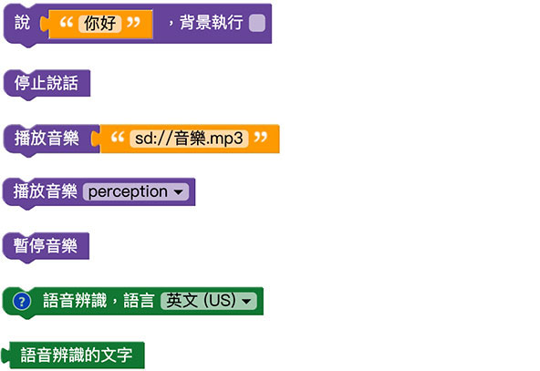

# 声音

凯比机器人本身内建播放声音的喇叭，能够朗读语音、播放音乐以及进行语音辨识，透过和使用者声音的互动，更能展现机器人充满人性化的一面。

## 声音积木清单

声音积木包含了说 ( 凯比机器人讲话 )、停止说话、播放 mp3 音乐 ( 网路 mp3 或 SD 卡的 mp3 )、播放内建音乐、暂停音乐以及语音辨识。

## 一边说话一边播放音乐

使用「说」的积木，勾选背景执行 ( 如此才不会影响到后续的程式 )，搭配「播放 mp3 音乐」的积木 ( 内建音乐不支援同时说话和音乐 )，部署机器人执行后，就会看见机器人边讲话边播音乐。

> 如果要使用 SD 卡的音乐，可将音乐放入 SD 卡内，路径输入「*sd://音乐.mp3*」

## 语音辨识 ( 你说什么我说什么 )

将「语音辨识」的积木、「说」的积木放在「重复无限次」的回圈里，让机器人说出「语音辨识的文字」( 此处不要勾选背景执行 )。

部署机器人执行后，机器人就会开始进行语音辨识，辨识时右上角会出现一个麦克风闪烁的图示，这时对着机器人讲话，辨识成功后，机器人就会讲出辨识的语句。

