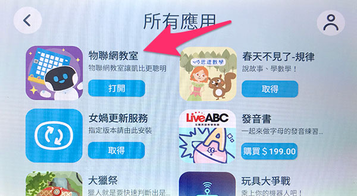
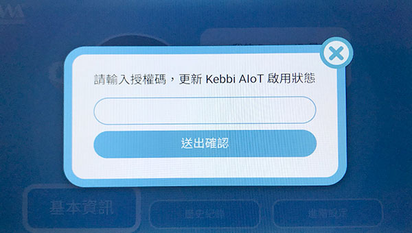
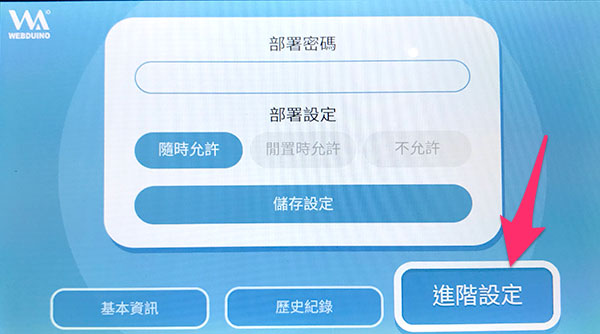

# 授权启用与设定

如果要使用凯比机器人的物联网教室 APP，必须进行凯比机器人的授权认证，这篇文章会介绍如何进行物联网教室 APP 的授权。

> 如果*已经使用过物联网教室 APP 但没有密码*，请往下直接阅读 [设定密码与部署模式](#auth05)

## 使用物联网教室 APP{{auth01}}

用手指在凯比机器人的脸上，从上往下滑动展开选单，点选九宫格的桌面图示开启桌面，在桌面上找到「物联网教室」的 APP，点选开启物联网教室。

如果找不到物联网教室的 APP，可以在桌面上点选「女娲商店」。

在商店的「所有应用」中，找到「物联网教室」的 APP，点击进行安装。

## 第一次使用{{auth02}}

如果是第一次使用物联网教室，开启后，会出现「请输入授权码，启用 Kebbi AIoT」的画面，输入包装盒内的授权码，就可启用物联网教室。。

> **如果是 0.94 的版本，请更新凯比机器人和物联网教室 APP 到 0.95 版本**。

## 检查使用天数{{auth03}}

启用之后，在画面里可以看到启用的状态以及天数。

## 更新授权{{auth04}}

点击「授权天数」的文字，就可以进行授权码的更新。

输入更新的授权码，就能更新机器人授权。

## 设定密码与部署模式{{auth05}}

启用完成后，在开始的画面可以看到机器人的 ID。

点选「进阶设定」，可以修改部署密码以及部署状态，这是之后将程式部署到机器人时，可以提供的安全性保护
，修改完成后，按下储存，设定完成。

