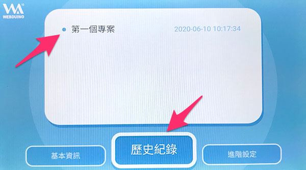
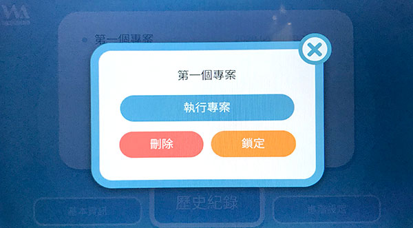

# 程式部署

当机器人的 Wi-Fi 和授权都设定完成后，就可以准备将程式透过物联网教室 APP，部署到凯比机器人，进一步操控凯比机器人的动作，或是和物联网套件连动。

## 开启并登入凯比物联网教室

使用 Chrome 浏览器打开凯比物联网教室，使用机器人的 ID 和所设定的密码登入。

> 凯比物联网教室：[https://kebbi.webduino.io](https://kebbi.webduino.io#_blank)
>
> 机器人授权与密码设定请参考：[授权启用与设定](authorize.html)

## 使用 Web:Bit 程式积木

登入后，画面上有「*Web:Bit 程式积木*」和「*Webduino 影像训练*」两个主要功能，点选「Web:Bit 程式积木」，开始编辑凯比机器人的动作程式。

开启「Web:Bit 程式积木」后，从左侧清单找到「凯比机器人」积木。

找出并放入「*说哈啰*」的积木，接着放入「*日常反应哈啰*」的积木。

完成后，将滑鼠移到右上方的「*更多*」选单，点选「*部署到机器人*」。

输入这个程式的专案名称，以及登入时的密码，就能将程式部署到凯比机器人，部署成功后，就会看见凯比机器人先说哈啰，然后手舞足道地挥挥手。

## 再次执行专案

如果想要再次执行这个程式专案，只要用手指在凯比机器人的脸上，往下滑动展开选单，点选九宫格的桌面图示回到桌面，再次开启「物联网教室」APP 之后，点选「历史专案」，点击刚刚部署的专案名称。

点击「执行专案」，就能再次执行。

