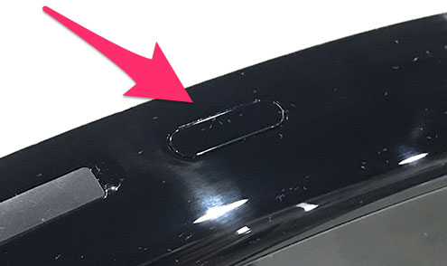
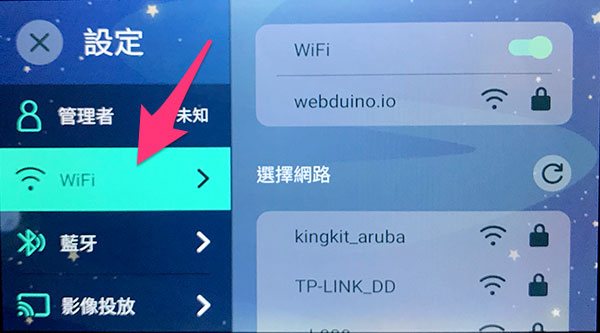

# Wi-Fi 设定

这篇文章会介绍凯比机器人的 Wi-Fi 设定流程，协助大家将凯比机器人连接上所在场所的网路。

## 机器人开机，进入桌面

手指按住凯比机器人头上的电源钮，直到将凯比机器人开机。

开机后，用手指在凯比机器人的脸上，从上往下滑动展开选单，点选九宫格的桌面图示。

点选后，就会开启凯比机器人的桌面。

## 设定 Wi-Fi 连线

桌面开启后，找到「设定」的 APP 图示，点选进入。

选择左侧 Wi-Fi 选项，找到所在场所的网路，输入网路连线密码，即可进行网路连线，设定完成后，凯比机器人就能连上所在场所的 Wi-Fi。

