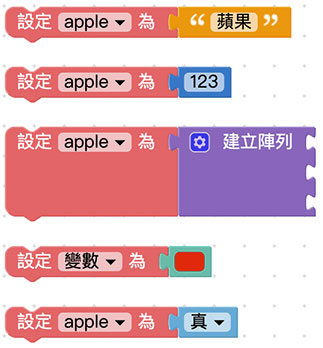
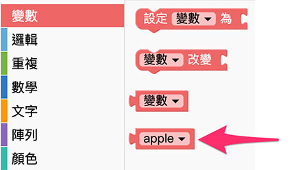
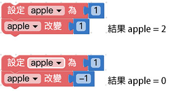

# Web:Bit 變數

變數，是所有程式都會用到的基本元素，使用前會賦予變數一個名稱，接著就可以用這個變數來表示文字、數字、陣列、顏色或邏輯，為什麼要使用變數呢？因為在編輯程式往往會遇到許多「重複」的部分，如果用變數或函式裝載這些重複的部分，就能很簡單的進行「一次性」新增、刪除或修改動作。

舉例來說，如果一段文章出現了五十次「A」，要把「A」修改為「B」，若不使用變數則得要手動修改五十次才辦得到 ( 不考慮編輯軟體的搜尋取代功能 )，但如果今天我們用「變數 a 等於 A」，在修改的時候只需做一次動作：「把變數 a 等於 B」，就能把所有的「A」換成「B」，下方的教學內容將會深入介紹。

## 新增變數{{add}}

使用變數的第一步，就是「新增一個變數」，打開 Web:Bit 編輯器，將「*設定變數為*」的積木拖拉到畫面中，下拉選單選擇「*新變數*」，點選後彈出對話視窗，輸入新變數的名稱及可新增一個變數。( 建議變數的命名盡可能以「英文 + 數字」為主 )

在新增的變數後方加上對應的值 ( 值可以是文字、數字、陣列、顏色或邏輯 )，這個變數就等同於這個值，如果沒有賦予值，這個變數就是空變數。

新增變數後，在左側積木清單的變數目錄下，也會看到新增的變數積木。

> 注意，如果在編輯畫面裡完全沒有「設定變數為 XXX」的積木，積木清單裡就不會看見 XXX 的變數積木。

## 設定變數{{set}}

設定變數表示賦予變數一個值，使用方式和新增變數完全相同，由於程式語言有「*後面覆蓋前面*」的特性，所以*如果變數名稱相同，後面設定的值會覆蓋掉前面設定的值*，以下圖的例子而言，變數 apple 最後的值為 456。

## 重新命名變數{{rename}}

有別於「新增變數」，重新命名變數可以將畫面中所有的變數一次改名，例如畫面裡出現了四次 apple 的變數，透過重新命名，可以將四個 apple 變數名稱全部換成 ball。

## 改變變數{{change}}

改變變數表示「*讓變數的值改變多少*」，假設原本變數的值為 1，使用改變變數 1 之後，這個變數就會變成 2，同理，如果使用改變變數 -1，那麼這個變數就會變成 0。

注意，如果是不同類型的改變，例如原本的變數是文字「蘋果」，卻改變數字「1」，最後得到的結果是「蘋果1」三個字，同理如果是變數是「1」，而改變文字「蘋果」，得到的結果是「1蘋果」。

## 使用變數{{use}}

新增變數或設定變數完成後，就可以在編輯區中使用變數，以下圖為例，先設定 a 變數為 1，b 變數為 2，接著就能計算 a + b 或 a 除以 b 之類的數學運算，或透過邏輯判斷 a 和 b 哪個值比較大，當程式邏輯越來越複雜，就得藉由不同的變數來實作。

