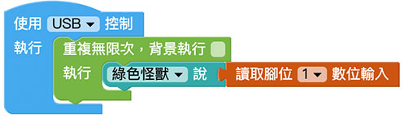
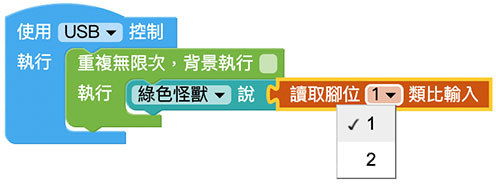
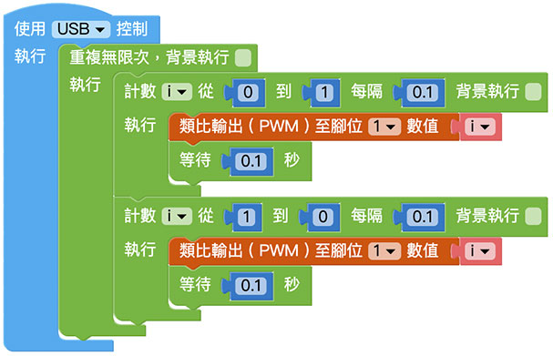

# Web:Bit I/O 引腳

在 Web:Bit 開發板邊緣有一排有 25 個金屬接觸點，這些金屬接觸點稱為「引腳」，或通俗一點也可稱呼「金手指」。 引腳包含了 5 個標註 0、1、2、3V 和 GND 的大引腳，以及其他 20 個未標示號碼的小引腳，除了可以使用鱷魚夾操作大引腳，也可以使用擴充板搭配杜邦線操作小引腳，透過引腳的搭配，就能靈活的操作各種外接元件與感測器。

> 如果要使用 I/O 引腳功能，需搭配 Web:Bit 擴充板，購買方式請參考：[Web:Bit 擴充板](https://store.webduino.io/products/webbit-extension-board?utm_source=webbit&utm_medium=article#_blank)

## I/O 引腳對照表

## I/O 引腳積木清單

I/O 引腳積木包含數位和類比輸入、數位和類比 ( PWM ) 輸出共四種積木。

> *I/O 引腳積木必須搭配「開發板」積木，且不支援模擬器*，只支援 USB 與 Wi-Fi 控制。
> - USB 控制模式為「安裝版編輯器」限定，請參考 [Web:Bit 編輯器](../index.html#software)
> - Wi-Fi 模式需要開發板連接 Wi-Fi，請參考 [Web:Bit 硬體開發板 ( 初始化設定 )](../info/setup.html)

## 讀取數值 ( 數位輸入 ){{pin01}}

使用數位輸入的積木，讀取的數值只會有 1 和 0 兩種訊號，預設在完全沒有接傳感器的狀態下數值為 1，程式積木透過一個無窮重複迴圈的積木，不斷讀取腳位訊號。

可以使用「杜邦線 + 麵包板 + 電阻」進行測試，並採取「*上拉電阻*」的方法，在程式執行後，將杜邦線連接訊號線和 GND ( 或按下開關 )，程式便會收到 0 的訊號。

## 讀取數值 ( 類比輸入 ){{pin02}}

使用類比輸入的積木，讀取的數值為 0～1 之間的浮點數，程式積木透過一個無窮重複迴圈的積木，不斷讀取腳位訊號。( 類比輸入僅支援 1 號和 2 號引腳 )

可以使用「光敏電阻 + 杜邦線 + 麵包板 + 電阻」進行測試，下方範例並採取「*下拉電阻*」的方法，在程式執行後，程式便會收到 0～1 的類比訊號，光線越強數字越大，光線越弱數字越小。

## 輸出數值{{pin03}}

輸出的積木分成兩種，一種是類比輸出 ( PWM )，可以輸出 0～1 之間的浮點數，另外一種是數位輸出，僅能輸出 0 和 1 兩種數值，以下方的例子而言，透過一個迴圈的方式，透過*類比輸出*積木，不斷輸出 0～1 之間的浮點數作為 LED 的亮度，就能做出呼吸燈的效果。( 直接將 LED 長腳接在擴充板的 1 號引腳，短腳接在 GND )

如果使用*數位輸出*積木，雖然無法設計 LED 呼吸燈的效果，但仍然可以透過迴圈，設計出燈光閃爍的範例。

