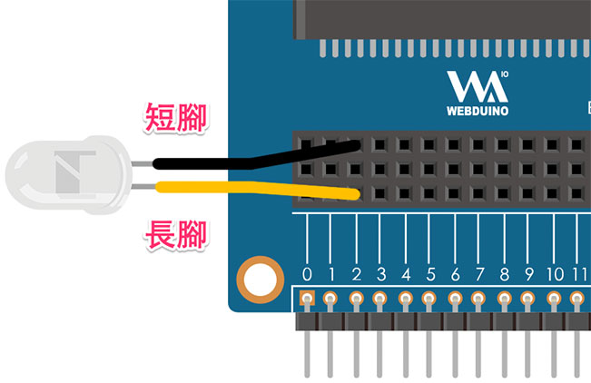
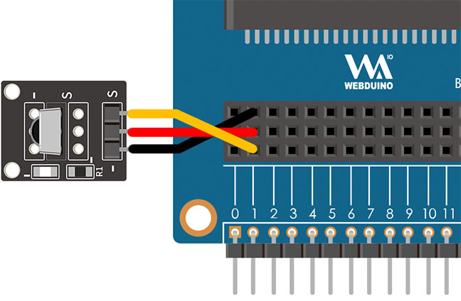

# 紅外線發射＆接收

紅外線發射與接收，常見於我們日常生活的電器用品，只要是透過「紅外線遙控器」操控的電器 ( 電視機、冷氣機、玩具...等 )，都是利用紅外線發射與接收的原理，這篇教學將會介紹如何透過 Web:Bit 偵測遙控器訊號以及發送紅外線訊號。

> 如果要使用紅外線發射＆接收功能，需搭配 Web:Bit 擴充板，購買方式請參考：[Web:Bit 擴充板](https://store.webduino.io/products/webbit-extension-board?utm_source=webbit&utm_medium=article#_blank)

## 紅外線發射＆接收 積木清單

紅外線發射＆接收積木分為接收和發射，接收的積木又分成「接收到訊號...執行」和「接收到的代碼」兩種。

> *紅外線發射＆接收積木必須搭配「開發板」積木，且不支援模擬器*，只支援 USB 與 Wi-Fi 控制。
>
> - USB 控制模式為「安裝版編輯器」限定，請參考 [Web:Bit 編輯器](../index.html#software)
>
> - Wi-Fi 模式需要開發板連接 Wi-Fi，請參考 [Web:Bit 硬體開發板 ( 初始化設定 )](../info/setup.html)

## 紅外線發射 接線圖

將紅外線發射的長腳接在 Web:Bit 擴充板的 *2 號腳位*，短腳接在 GND 的位置。( 因為硬體設計限制，紅外線發射僅能使用 2 號腳 )

## 發射紅外線訊號

紅外線發射的積木可以發送十六進位的紅外線代碼，只要將已知的代碼填入發射的欄位，執行後就會發送對應代碼。

如果搭配小怪獸的點擊行為，就能夠讓點擊綠色怪獸和點擊紅色怪獸時，分別發送不同的紅外線訊號。

## 紅外線接收 接線圖

將紅外線接收的訊號腳 S 接在 Web:Bit 擴充板的 *1 號腳位*，- 號腳接在 GND，中間的腳位接在 3.3V 的位置。( 因為硬體設計限制，紅外線接收僅能使用 1 號腳 )

## 接收紅外線訊號

紅外線接收的積木有兩個，執行後就會不斷即時接收紅外線訊號，只要收到訊號，就可以透過「接收到的代碼」顯示，下圖的程式積木組合，執行後會透過綠色小怪獸顯示遙控器發射的代碼。

如果搭配[邏輯判斷](/zh-tw/docs/webbit/basic/logic.html)，就能夠透過紅外線遙控器遙控 LED 點矩陣的圖案顯示，下圖的程式積木組合，在收到 A12345678 訊號時顯示紅色笑臉，收到 B87654321 訊號時顯示綠色方塊。

