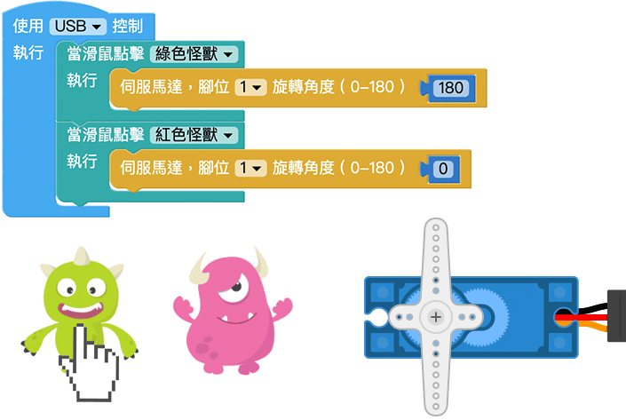

# 伺服馬達

伺服馬達會依照指示命令動作，由程式控制馬達的旋轉角度，馬達就會轉幾度，搭配各種不同的齒輪組合，就能實際應用在玩具、模型屋、機械夾臂...等領域，實現許多有趣好玩的創意。

> 如果要使用伺服馬達功能，需搭配 Web:Bit 擴充板，購買方式請參考：[Web:Bit 擴充板](https://store.webduino.io/products/webbit-extension-board?utm_source=webbit&utm_medium=article#_blank)

## 伺服馬達 積木清單

伺服馬達積木可以設定腳位以及指定旋轉的角度 ( 0～180 度 )。

> *伺服馬達積木必須搭配「開發板」積木，且不支援模擬器*，只支援 USB 與 Wi-Fi 控制。
>
> - USB 控制模式為「安裝版編輯器」限定，請參考 [Web:Bit 編輯器](../index.html#software)
>
> - Wi-Fi 模式需要開發板連接 Wi-Fi，請參考 [Web:Bit 硬體開發板 ( 初始化設定 )](../info/setup.html)

## 伺服馬達 接線圖

將伺服馬達的橘色線 ( 訊號線 ) 接在 Web:Bit 擴充板的 1 號腳，紅色線接到 3.3V，棕色線接到 GND。

> 注意，因 Web:Bit 擴充板輸出電壓為 3.3V，請確認伺服馬達為支援 3.3V 的型號。

## 改變旋轉角度

使用「點擊小怪獸」的積木，設定點擊綠色小怪獸時伺服馬達旋轉至 180 度，點擊紅色小怪獸時伺服馬達旋轉至 0 度，程式執行後，就可以透過滑鼠點擊小怪獸控制伺服馬達。

