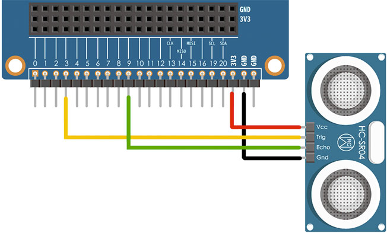
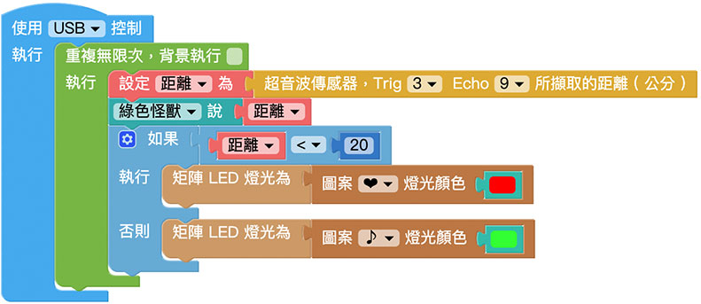

# 超音波傳感器

超音波傳感器主要用來偵測距離，透過發送的超音波碰撞到物體之後反射回來的時間差，就能計算超音波傳感器與相對應物體之間的距離，不過因為超音波有指向性，如果今天受測的物體是傾斜的，超音波可能就會被反彈到別的地方，或是今天待測物會吸收聲波，可能測出來的距離就會有不準確的情形發生。

> - 如果要使用超音波傳感器功能，需搭配 Web:Bit 擴充板，購買方式請參考：[Web:Bit 擴充板](https://store.webduino.io/products/webbit-extension-board?utm_source=webbit&utm_medium=article#_blank)
>
> - 本篇教學內容等同「[擴充套件包 - 超音波傳感器](../extension-full-package/ultrasonic.html)」

## 超音波傳感器 積木清單

超音波傳感器的積木可以設定 Trig 和 Echo 的腳位，腳位數字對應實際的接線，執行後會取得偵測到的距離 ( 公分 )。

> *超音波傳感器積木必須搭配「開發板」積木，且不支援模擬器*，只支援 USB 與 Wi-Fi 控制。  
>
> 詳情請參考 [Web:Bit 開發板](https://webbit.webduino.io/tutorials/doc/zh-tw/education/board/board.html)

## 超音波傳感器 接線圖

將超音波傳感器 HC-SR04 的 Trig 接在 Web:Bit 擴充板的 3 號腳，Echo 接到 9 號腳，VCC 接到 3.3V，GND 接到 GND。

## 即時偵測距離

將超音波擷取距離的積木，放在「重複無限次」的積木裡，下圖的程式積木執行後，用手或遮蔽物靠近或遠離超音波傳感器，小怪獸就會即時講出所偵測的距離。

## 不同距離顯示不同顏色

如果搭配「邏輯」和「矩陣 LED」的積木，也能實現不同距離顯示不同圖案顏色的效果，下圖的程式積木執行後，用手或遮蔽物靠近或遠離超音波傳感器，除了小怪獸就會即時講出所偵測的距離，當距離小於 20 公分時矩陣 LED 會出現紅色愛心，否則就是綠色的音符。

