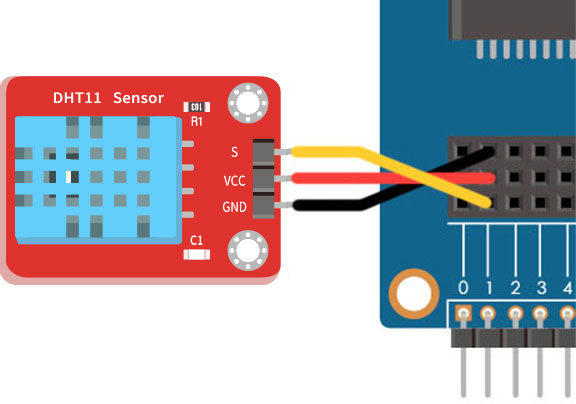
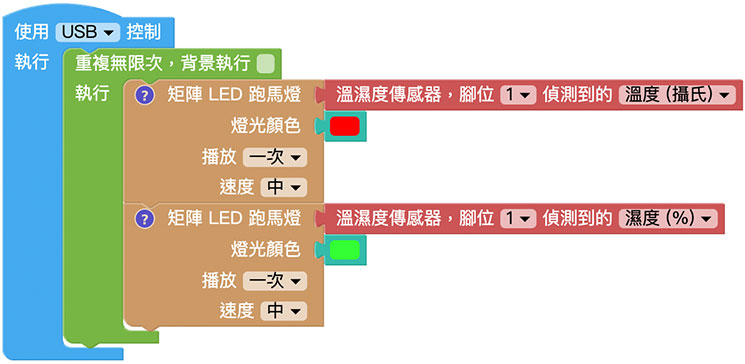
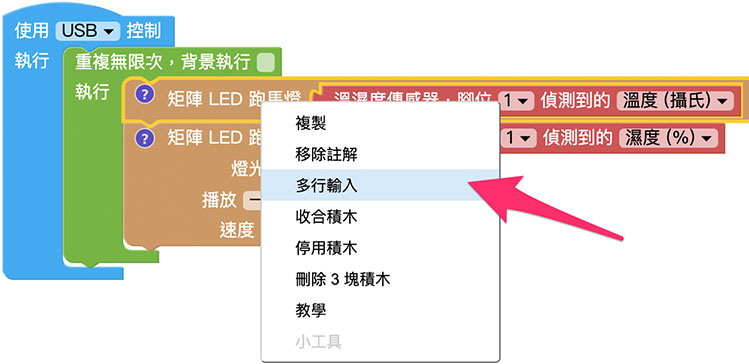

# 溫濕度感測器

溫濕度感測器可以偵測外界環境的溫濕度變化，在 Web:Bit 擴充套件包的溫濕度感測器型號是 DHT11，濕度測量範圍是 20%～95% ( 請勿放入水中 )，溫度測量範圍是 0 度 C ～ 50 度 C ( 請勿高溫燒烤 )，若再搭配 Google 試算表作為簡單的資料庫，就能實現定時紀錄溫濕度的功能。

> 如果要使用溫濕度感測器，需搭配 Web:Bit 擴充板，購買方式請參考：[Web:Bit 擴充板](https://store.webduino.io/products/webbit-extension-board?utm_source=webbit&utm_medium=article#_blank)

## 溫濕度感測器積木清單

溫濕度感測器積木可以透過指定的腳位，讀取溫度 ( 攝氏 ) 與濕度 ( % )。

## 溫濕度感測器接線圖

將擴充套件包裡的溫濕度感測器的 S 連接 Web:Bit 開發板 1 號腳，VCC 連接 3.3V，GND 連接 GND。

## 小怪獸顯示溫濕度

分別將綠色和紅色「小怪獸說話」的積木放入「重複無限次」的積木裡，再將「溫濕度傳感器，腳位 X 偵測到的溫度」連接綠色小怪獸積木，將「溫濕度傳感器，腳位 X 偵測到的溼度」連接紅色小怪獸積木，程式執行後，就會看見綠色小怪獸講出溫度，紅色小怪獸講出濕度。

## Web:Bit 跑馬燈顯示溫濕度

如果將上方範例的小怪獸換成矩陣 LED 跑馬燈，就可以透過跑馬燈依序顯示紅色的溫度數值和藍色的濕度數值。

如果覺得積木長度太長，可以在積木上方按壓滑鼠右鍵，若出現「多行輸入」表示該積木可以換行顯示。

