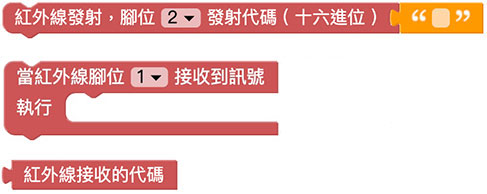

# 紅外線發射＆接收

紅外線發射與接收，常見於我們日常生活的電器用品，只要是透過「紅外線遙控器」操控的電器 ( 電視機、冷氣機、玩具...等 )，都是利用紅外線發射與接收的原理，這篇教學將會介紹如何透過 Web:Bit 偵測遙控器訊號以及發送紅外線訊號。

> - 如果要使用紅外線發射＆接收功能，需搭配 Web:Bit 擴充板，購買方式請參考：[Web:Bit 擴充板](https://store.webduino.io/products/webbit-extension-board?utm_source=webbit&utm_medium=article#_blank)
>
> - 本篇教學內容等同「[基礎套件包 - 紅外線發射＆接收](../extension-basic-package/ir.html)」

## 紅外線發射＆接收 積木清單

紅外線發射＆接收積木分為接收和發射，接收的積木又分成「接收到訊號...執行」和「接收到的代碼」兩種，紅外線接收的積木屬於持續偵測的積木，不需要搭配迴圈就能即時偵測。

> 因為紅外線有編碼的區別，所以如果是使用冷氣遙控器，接收訊號的積木下拉選單必須選擇「冷氣」。

## 紅外線接收 接線圖

使用擴充套件包的紅外線接收模組，將 S 訊號腳連接 Web:Bit 擴充板的 1 號腳，VCC 連接 3V3，GND 連接 GND。

## 小怪獸顯示紅外線訊號

放入「當一般/冷氣紅外線，腳位 X 接收到訊號」的積木，在偵測到紅外線訊號時，讓綠色怪獸顯示紅外線的訊號，程式執行後，使用紅外線遙控器對準接收器發送訊號，就能看見小怪獸顯示數值。

如果需要複製數值，可直接用滑鼠在訊號文字上點兩下，選取複製即可。( 如果是偵測冷氣紅外線訊號，編碼字數可能會很長 )

## 紅外線搖空氣，遙控燈號

延續上方的程式如果搭配「邏輯判斷」的積木，就能夠透過紅外線遙控器遙控 LED 點矩陣的圖案顯示，程式執行後，在收到 A12345678 訊號時顯示紅色笑臉，收到 B87654321 訊號時顯示綠色方塊。

> 範例：[紅外線搖空氣，遙控燈號](https://webbit.webduino.io/blockly/?demo=default#ayxv98l9P7JqM)

## 紅外線發射 接線圖

使用擴充套件包的紅外線發射模組，將 S 訊號腳連接 Web:Bit 擴充板的 2 號腳，VCC 連接 3V3，GND 連接 GND。

## 點擊小怪獸，發射紅外線訊號

紅外線發射的積木可以發送十六進位的紅外線代碼，只要將已知的代碼填入發射的欄位，執行後就會發送對應代碼。

